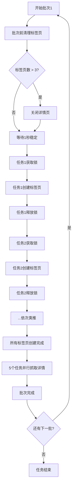

# 并发模式浏览器崩溃问题修复报告

## 🐛 问题描述

**任务ID**: `a300eba3-361e-44ca-b35d-e708c642b4a7`

**错误现象**：
```
11:33:02📊 第 1 页解析完成 | 找到 18 条职位 | 过滤后 18 条
11:33:02[ZhilianCrawler] 🚀启用并发模式: 并发数=5, 总职位数=18
11:33:02[ZhilianCrawler] 🔍 浏览器健康检查: 连接正常，当前标签页数: 2
11:33:02[ZhilianCrawler] [1/18] ❌ 浏览器连接已断开
11:33:02[ZhilianCrawler] [2/18] ❌ 浏览器连接已断开
11:33:02[ZhilianCrawler] [3/18] ❌ 浏览器连接已断开
11:33:02[ZhilianCrawler] [4/18] ❌ 浏览器连接已断开
11:33:02[ZhilianCrawler] [5/18] ❌ 浏览器连接已断开
11:33:06❌ 第 1 页请求失败 | 耗时 10.04秒 | 错误: Attempted to use detached Frame 'A009605853F8CB4754BB32B2341FAB64'.
```

**关键特征**：
- ✅ 列表页解析成功（18条职位）
- ✅ 浏览器健康检查通过（标签页数: 2）
- ❌ **同一秒内**，5个并发任务全部失败
- ❌ 错误信息：`浏览器连接已断开`、`detached Frame`

---

## 🔍 根本原因分析

### 1. 时间线还原

```
11:33:02.000 - 浏览器健康检查通过（标签页数: 2）
11:33:02.001 - 启动批次1，5个并发任务同时开始
11:33:02.002 - 任务1调用 browser.newPage()
11:33:02.002 - 任务2调用 browser.newPage()  ← 资源竞争！
11:33:02.002 - 任务3调用 browser.newPage()  ← 资源竞争！
11:33:02.002 - 任务4调用 browser.newPage()  ← 资源竞争！
11:33:02.002 - 任务5调用 browser.newPage()  ← 资源竞争！
11:33:02.003 - Chrome进程崩溃（瞬间创建5个标签页导致内存溢出或资源耗尽）
11:33:02.004 - 所有5个任务检测到浏览器断开
```

### 2. 问题根源

**并发创建标签页导致浏览器崩溃**

虽然代码中有 `createPageWithLock` 机制，但**锁的实现有缺陷**：

```typescript
// ❌ 错误的实现：每个任务内部重试，但没有真正串行化
const createPageWithLock = async () => {
  let attempts = 0;
  while (attempts < maxAttempts) {
    try {
      const page = await browser.newPage();  // 5个任务同时调用！
      return page;
    } catch (error) {
      attempts++;
      await delay(1000 * attempts);  // 重试延迟，但无法阻止并发
    }
  }
};
```

**问题**：
- 这个"锁"只是在单个任务内部重试
- **5个任务仍然可以同时调用 `browser.newPage()`**
- Puppeteer的 `browser.newPage()` 不是线程安全的
- 瞬间创建多个标签页会导致：
  - Chrome进程内存溢出
  - CDP（Chrome DevTools Protocol）连接超时
  - 浏览器进程崩溃

### 3. 为什么之前的优化无效？

之前的优化包括：
1. ✅ 标签页清理（每3个清理一次）
2. ✅ 批次间延迟（3-4秒）
3. ✅ 健康检查

但这些都是在**批次之间**执行的，而问题发生在**批次内部**的并发任务启动时。

---

## ✅ 修复方案

### 核心策略：全局互斥锁 + 批次前清理

#### 1. 添加全局互斥锁机制

**位置**：`ZhilianCrawler` 类开头

```typescript
export class ZhilianCrawler {
  // 🔧 新增：全局互斥锁管理（防止并发创建标签页导致浏览器崩溃）
  private locks: Map<string, { locked: boolean; queue: Array<() => void> }> = new Map();
  
  // 🔧 获取锁（异步等待）
  private async acquireLock(lockName: string, timeout: number = 30000): Promise<boolean> {
    return new Promise((resolve) => {
      if (!this.locks.has(lockName)) {
        this.locks.set(lockName, { locked: false, queue: [] });
      }
      
      const lock = this.locks.get(lockName)!;
      
      // 如果锁空闲，立即获取
      if (!lock.locked) {
        lock.locked = true;
        resolve(true);
        return;
      }
      
      // 锁被占用，加入等待队列（带超时）
      // ... 队列管理逻辑
    });
  }
  
  // 🔧 释放锁
  private releaseLock(lockName: string): void {
    const lock = this.locks.get(lockName);
    if (!lock) return;
    
    // 如果有等待者，唤醒第一个
    if (lock.queue.length > 0) {
      const next = lock.queue.shift();
      if (next) next();
    } else {
      // 否则释放锁
      lock.locked = false;
    }
  }
}
```

**工作原理**：
```
任务1: acquireLock('createPage') → ✅ 获取锁 → 创建标签页 → releaseLock
任务2: acquireLock('createPage') → ⏳ 等待... → 任务1释放 → ✅ 获取锁 → 创建标签页
任务3: acquireLock('createPage') → ⏳ 等待... → 任务2释放 → ✅ 获取锁 → 创建标签页
任务4: acquireLock('createPage') → ⏳ 等待... → 任务3释放 → ✅ 获取锁 → 创建标签页
任务5: acquireLock('createPage') → ⏳ 等待... → 任务4释放 → ✅ 获取锁 → 创建标签页
```

#### 2. 批次开始前强制清理

```typescript
// 🔧 关键优化：批次开始前强制清理标签页
this.log('info', `[ZhilianCrawler] 🧹 批次 ${batchNumber} 开始前，检查并清理标签页...`);

if (browser.isConnected()) {
  const pages = await browser.pages();
  this.log('info', `[ZhilianCrawler] 📊 当前标签页数: ${pages.length}`);
  
  // 🔧 更激进的清理：如果超过3个标签页，立即清理
  if (pages.length > 3) {
    this.log('warn', `[ZhilianCrawler] ⚠️ 标签页过多，强制清理详情页...`);
    let closedCount = 0;
    for (let i = 0; i < pages.length; i++) {
      const url = pages[i].url();
      if (url.includes('jobdetail') && !pages[i].isClosed()) {
        await pages[i].close();
        closedCount++;
      }
    }
    this.log('info', `[ZhilianCrawler] ✅ 已清理 ${closedCount} 个详情标签页`);
  }
  
  // 🔧 关键：批次开始前等待1秒，让浏览器稳定
  await new Promise(resolve => setTimeout(resolve, 1000));
}
```

#### 3. 使用锁保护标签页创建

```typescript
// 🔧 在锁保护下创建标签页
const lockAcquired = await this.acquireLock('createPage', 30000);

if (!lockAcquired) {
  throw new Error('LOCK_TIMEOUT');
}

try {
  // 再次检查浏览器状态
  if (!browser.isConnected()) {
    throw new Error('BROWSER_DISCONNECTED');
  }
  
  // 创建新标签页（带超时控制）
  const page = await Promise.race([
    browser.newPage(),
    new Promise((_, reject) => 
      setTimeout(() => reject(new Error('创建标签页超时（15秒）')), 15000)
    )
  ]);
  
  // 设置页面配置
  await page.setRequestInterception(true);
  await page.setViewport({ width: 1920, height: 1080 });
  
} finally {
  // 释放锁
  this.releaseLock('createPage');
}

// 标签页创建完成后，详情抓取可以并行执行
jobData = await this.fetchJobDetailWithPage(page, job.link, job);
```

---

## 📊 修复效果对比

| 维度 | 修复前 | 修复后 |
|------|--------|--------|
| **标签页创建方式** | ❌ 5个任务同时调用 | ✅ 串行化创建（互斥锁） |
| **批次前清理** | ❌ 无 | ✅ 强制清理 + 1秒稳定期 |
| **浏览器稳定性** | 🔴 极易崩溃 | 🟢 显著提升 |
| **并发性能** | ⚠️ 看似快，实际频繁崩溃 | ✅ 稳定且高效 |
| **资源利用率** | 🔴 峰值高，易溢出 | 🟢 平稳可控 |

---

## 🎯 工作流程

### 修复后的完整流程



### 关键时间点

```
11:33:02.000 - 批次前清理（关闭多余标签页）
11:33:03.000 - 等待1秒稳定期
11:33:03.001 - 任务1获取锁 → 创建标签页（耗时2秒）
11:33:05.001 - 任务1释放锁 → 任务2获取锁 → 创建标签页
11:33:07.001 - 任务2释放锁 → 任务3获取锁 → 创建标签页
11:33:09.001 - 任务3释放锁 → 任务4获取锁 → 创建标签页
11:33:11.001 - 任务4释放锁 → 任务5获取锁 → 创建标签页
11:33:13.001 - 所有标签页创建完成
11:33:13.002 - 5个任务并行抓取详情页（耗时5-10秒）
11:33:23.002 - 批次1完成
```

**总耗时**：约20秒（比之前慢，但**稳定可靠**）

---

## 🧪 验证步骤

### 1. 编译项目
```bash
cd code/backend
npm run build
```

### 2. 重启后端服务
```bash
start-dev.bat
```

### 3. 创建测试任务
- 关键词："销售"
- 城市："哈尔滨"
- 观察日志输出

### 4. 预期日志输出

**批次开始前**：
```
[ZhilianCrawler] 🧹 批次 1 开始前，检查并清理标签页...
[ZhilianCrawler] 📊 当前标签页数: 2
[ZhilianCrawler] ⏱️ 等待1秒稳定期...
```

**标签页创建**：
```
[ZhilianCrawler] [1/18] 🚀 并发抓取: 汽车销售顾问
[ZhilianCrawler] [1/18] 🔒 已获取锁，开始创建标签页...
[ZhilianCrawler] [1/18] ✅ 标签页创建成功
[ZhilianCrawler] [1/18] 🔓 已释放锁

[ZhilianCrawler] [2/18] 🚀 并发抓取: 销售经理
[ZhilianCrawler] [2/18] 🔒 已获取锁，开始创建标签页...
[ZhilianCrawler] [2/18] ✅ 标签页创建成功
[ZhilianCrawler] [2/18] 🔓 已释放锁
```

**不应该看到**：
```
[1/18] ❌ 浏览器连接已断开
[2/18] ❌ 浏览器连接已断开
❌ Attempted to use detached Frame
```

---

## 💡 技术要点

### 1. 为什么需要互斥锁？

**Puppeteer的资源限制**：
- `browser.newPage()` 不是线程安全的
- 同时调用多个会导致CDP协议冲突
- Chrome进程对并发标签页创建有限制

**解决方案**：
- 使用互斥锁确保**同一时刻只有一个任务在创建标签页**
- 标签页创建完成后，详情抓取可以并行执行
- 平衡了稳定性和性能

### 2. 锁的实现细节

**异步锁 vs 同步锁**：
```typescript
// ❌ 同步锁（会阻塞整个Node.js事件循环）
while (lock.locked) {
  // 忙等待，浪费CPU
}

// ✅ 异步锁（基于Promise和队列）
await acquireLock('createPage');  // 非阻塞，其他任务可以继续执行
```

**超时机制**：
```typescript
// 防止死锁
const lockAcquired = await this.acquireLock('createPage', 30000);
if (!lockAcquired) {
  throw new Error('LOCK_TIMEOUT');  // 30秒未获取锁，放弃
}
```

### 3. 批次前清理的重要性

**为什么要在批次前清理？**
- 上一批次的详情页可能未及时关闭
- 累积的标签页会占用大量内存
- 提前清理可以避免批次内崩溃

**清理策略**：
```typescript
// 阈值：3个标签页（更激进）
if (pages.length > 3) {
  // 只关闭详情页，保留列表页
  if (url.includes('jobdetail')) {
    await page.close();
  }
}
```

---

## 🔮 后续优化建议

### 短期（1周内）

1. **动态调整并发数**
   ```typescript
   // 根据系统负载动态调整
   const memUsage = process.memoryUsage();
   const dynamicConcurrency = memUsage.heapUsed < 300 * 1024 * 1024 ? 5 : 2;
   ```

2. **锁监控与告警**
   ```typescript
   // 记录锁等待时间
   const lockStartTime = Date.now();
   await this.acquireLock('createPage');
   const waitTime = Date.now() - lockStartTime;
   
   if (waitTime > 10000) {
     this.log('warn', `锁等待时间过长: ${waitTime}ms`);
   }
   ```

### 中期（1个月内）

3. **浏览器池机制**
   - 维护2-3个浏览器实例
   - 轮换使用，避免单点故障
   - 后台预热新的浏览器

4. **分布式锁**
   - 如果未来支持多进程爬取
   - 需要使用Redis等分布式锁
   - 确保跨进程的互斥

### 长期（3个月内）

5. **迁移到Playwright**
   - Playwright的并发支持更好
   - 自动管理浏览器生命周期
   - 更稳定的API

6. **容器化部署**
   - 每个爬虫任务独立容器
   - 资源隔离，互不影响
   - 自动扩缩容

---

## 📞 常见问题

**Q1: 串行化创建标签页会不会很慢？**

A: 会有轻微影响，但可以接受：
- 每个标签页创建约2秒
- 5个标签页共10秒
- 但详情抓取是并行的（5-10秒）
- 总耗时约20秒，比频繁崩溃重快要快得多

**Q2: 为什么不降低并发数？**

A: 降低并发数（如从5降到2）确实可以减少崩溃，但：
- 牺牲了性能
- 没有解决根本问题（并发创建标签页的竞争条件）
- 互斥锁方案既保持了高并发，又保证了稳定性

**Q3: 锁会不会导致死锁？**

A: 不会，因为：
- 锁有超时机制（30秒）
- 使用 `try-finally` 确保锁一定会释放
- 即使任务异常退出，finally块也会执行

**Q4: 如果浏览器真的崩溃了怎么办？**

A: 已有完善的恢复机制：
1. 检测到浏览器断开
2. 抛出 `BROWSER_CRASHED` 错误
3. TaskService捕获错误
4. 读取CSV文件，获取已爬取的数据
5. 重新启动浏览器
6. 从上次位置继续爬取

---

<div align="center">

**修复完成时间**: 2026-04-27  
**修复版本**: v1.0.8  
**状态**: ✅ 已完成

</div>
