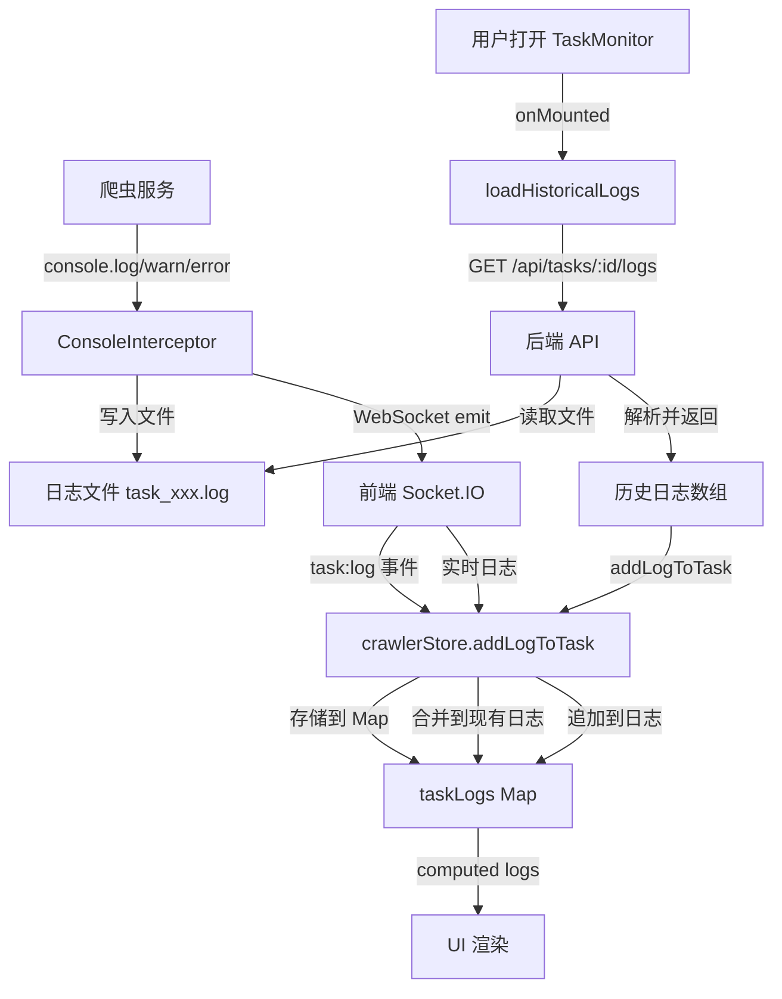

# 爬取日志持久化功能实现说明

## 📋 概述

已实现爬取日志的本地文件持久化存储,任务完成后仍可在"爬取详情"页面的"实时日志"中查看全量历史日志。

## ✨ 功能特性

### 1. 日志双重输出
- ✅ **WebSocket 实时推送**: 任务运行时实时推送到前端
- ✅ **本地文件存储**: 同时写入到本地日志文件,永久保存

### 2. 日志文件格式
```
================================================================================
任务ID: abc123-def456-ghi789
开始时间: 2026-04-23T10:30:00.000Z
================================================================================

[2026-04-23T10:30:01.123Z] [INFO] [TaskService] 开始启动任务: abc123-def456-ghi789
[2026-04-23T10:30:01.456Z] [INFO] [ConsoleInterceptor] 📝 日志文件已创建: /path/to/logs/task_abc123.log
[2026-04-23T10:30:02.789Z] [WARN] [ZhilianCrawler] ⚠️ 第 1 页检测到登录提示或验证码，可能被反爬
[2026-04-23T10:30:03.012Z] [ERROR] [Job51Crawler] ❌ 爬取第 2 页时出错: Connection timeout
...

================================================================================
结束时间: 2026-04-23T11:45:00.000Z
================================================================================
```

### 3. 日志级别
- **[INFO]**: 普通信息(绿色)
- **[WARN]**: 警告信息(黄色)
- **[ERROR]**: 错误信息(红色)

### 4. 历史日志加载
- ✅ 任务详情页打开时自动加载历史日志
- ✅ 支持限制返回数量(默认最近1000条)
- ✅ 与实时日志无缝衔接

## 🔧 技术实现

### 后端实现

#### 1. 日志目录配置 (`taskService.ts`)

```typescript
const logDir = path.join(__dirname, '../../data/logs');  // 日志目录

// 确保日志目录存在
if (!fs.existsSync(logDir)) {
  fs.mkdirSync(logDir, { recursive: true });
  console.log('[TaskService] ✅ 日志目录已创建:', logDir);
}
```

**日志文件路径**: `code/backend/data/logs/task_{taskId}.log`

#### 2. ConsoleInterceptor 增强

```typescript
class ConsoleInterceptor {
  private taskId: string;
  private logFilePath: string;           // 日志文件路径
  private writeStream: fs.WriteStream;   // 文件写入流

  constructor(taskId: string) {
    this.taskId = taskId;
    this.logFilePath = path.join(logDir, `task_${taskId}.log`);
  }

  start() {
    // 创建文件写入流(追加模式)
    this.writeStream = fs.createWriteStream(this.logFilePath, { 
      flags: 'a',  // append mode
      encoding: 'utf-8'
    });
    
    // 写入日志头部
    const startTime = new Date().toISOString();
    this.writeStream.write(`\n${'='.repeat(80)}\n`);
    this.writeStream.write(`任务ID: ${this.taskId}\n`);
    this.writeStream.write(`开始时间: ${startTime}\n`);
    this.writeStream.write(`${'='.repeat(80)}\n\n`);
    
    // 拦截 console.log
    console.log = function(...args: any[]) {
      self.originalConsoleLog.apply(console, args);
      
      // 写入日志文件
      const timestamp = new Date().toISOString();
      const message = args.map(arg => 
        typeof arg === 'object' ? JSON.stringify(arg, null, 2) : String(arg)
      ).join(' ');
      const logLine = `[${timestamp}] [INFO] ${message}\n`;
      if (self.writeStream) {
        self.writeStream.write(logLine);
      }
      
      // 同时推送到前端
      if (io && self.taskId) {
        io.to(`task:${self.taskId}`).emit('task:log', {
          taskId: self.taskId,
          level: 'info',
          message: message,
          timestamp: timestamp
        });
      }
    };
    
    // ... 同样处理 warn, error, info
  }

  stop() {
    // 关闭文件写入流
    if (this.writeStream) {
      const endTime = new Date().toISOString();
      this.writeStream.write(`\n${'='.repeat(80)}\n`);
      this.writeStream.write(`结束时间: ${endTime}\n`);
      this.writeStream.write(`${'='.repeat(80)}\n`);
      
      this.writeStream.end(() => {
        console.log(`[ConsoleInterceptor] 📝 日志文件已保存: ${this.logFilePath}`);
      });
      this.writeStream = null;
    }
    
    // 恢复原始 console
    console.log = this.originalConsoleLog;
    console.warn = this.originalConsoleWarn;
    console.error = this.originalConsoleError;
    console.info = this.originalConsoleInfo;
  }
}
```

**关键特性:**
- 使用 Node.js `fs.WriteStream` 实现流式写入,性能优异
- 追加模式(`flags: 'a'`),支持断点续传时继续写入
- 同时输出到控制台和文件,不影响调试
- 任务结束时优雅关闭流,写入结束标记

#### 3. 获取日志 API (`taskController.ts`)

```typescript
export async function getTaskLogs(req: Request, res: Response) {
  try {
    const { id: taskId } = req.params;
    const { limit = 1000 } = req.query;  // 默认返回最近1000条
    
    // 构建日志文件路径
    const logDir = require('path').join(__dirname, '../../data/logs');
    const logFilePath = require('path').join(logDir, `task_${taskId}.log`);
    
    // 检查日志文件是否存在
    if (!require('fs').existsSync(logFilePath)) {
      return res.json({
        success: true,
        data: {
          taskId,
          logs: [],
          totalLines: 0,
          hasMore: false
        }
      });
    }
    
    // 读取日志文件
    const fs = require('fs');
    const logContent = fs.readFileSync(logFilePath, 'utf-8');
    const lines: string[] = logContent.split('\n').filter((line: string) => line.trim());
    
    // 解析日志行
    const parsedLogs = lines
      .filter((line: string) => line.match(/^\[\d{4}-\d{2}-\d{2}T/))  // 只保留带时间戳的行
      .map((line: string) => {
        const match = line.match(/^\[(.*?)\] \[(INFO|WARN|ERROR)\] (.*)$/);
        if (match) {
          return {
            timestamp: match[1],
            level: match[2].toLowerCase(),
            message: match[3]
          };
        }
        return null;
      })
      .filter((log: any) => log !== null);
    
    // 限制返回数量(从后往前取最近的N条)
    const limitNum = parseInt(limit as string);
    const recentLogs = parsedLogs.slice(-limitNum);
    
    res.json({
      success: true,
      data: {
        taskId,
        logs: recentLogs,
        totalLines: parsedLogs.length,
        hasMore: parsedLogs.length > limitNum
      }
    });
  } catch (error: any) {
    res.status(500).json({
      success: false,
      error: error.message || '服务器内部错误'
    });
  }
}
```

**API 端点**: `GET /api/tasks/:id/logs?limit=1000`

**响应格式**:
```json
{
  "success": true,
  "data": {
    "taskId": "abc123",
    "logs": [
      {
        "timestamp": "2026-04-23T10:30:01.123Z",
        "level": "info",
        "message": "[TaskService] 开始启动任务: abc123"
      },
      {
        "timestamp": "2026-04-23T10:30:02.456Z",
        "level": "warning",
        "message": "[ZhilianCrawler] ⚠️ 第 1 页检测到登录提示"
      }
    ],
    "totalLines": 1523,
    "hasMore": true
  }
}
```

#### 4. 路由配置 (`taskRoutes.ts`)

```typescript
// 获取任务日志(新增)
router.get('/:id/logs', taskController.getTaskLogs);
```

### 前端实现

#### 1. API 封装 (`task.ts`)

```typescript
export const taskApi = {
  // ... 其他方法
  
  // 获取任务日志(新增)
  getTaskLogs(id: string, limit?: number): Promise<ApiResponse<{ 
    taskId: string
    logs: Array<{
      timestamp: string
      level: 'info' | 'warning' | 'error'
      message: string
    }>
    totalLines: number
    hasMore: boolean
  }>> {
    const params = limit ? { limit } : {}
    return api.get(`/tasks/${id}/logs`, { params }) as any
  }
}
```

#### 2. Store 增强 (`crawler.ts`)

```typescript
// 为指定任务添加日志,支持自定义时间戳
function addLogToTask(taskId: string, level: string, message: string, customTime?: string) {
  if (!taskLogs.value.has(taskId)) {
    taskLogs.value.set(taskId, [])
  }
  
  const taskLogList = taskLogs.value.get(taskId)!
  taskLogList.push({
    time: customTime || new Date().toLocaleTimeString('zh-CN', { hour12: false }),
    level,
    message
  })
  
  // 限制每个任务的日志数量(最多500条)
  if (taskLogList.length > 500) {
    taskLogList.shift()
  }
}
```

**关键改进:**
- 添加 `customTime` 可选参数,支持历史日志的时间戳
- 保持向后兼容,不传则使用当前时间

#### 3. TaskMonitor 页面增强

```vue
<script setup lang="ts">
onMounted(async () => {
  crawlerStore.connectSocket()
  crawlerStore.subscribeTask(taskId)
  await crawlerStore.loadTasks()
  
  const task = Array.isArray(crawlerStore.tasks) 
    ? crawlerStore.tasks.find(t => t.id === taskId) || null 
    : null
  
  crawlerStore.setCurrentTask(task)
  
  // 🔧 新增: 加载历史日志(从后端读取)
  await loadHistoricalLogs()
  
  // 加载任务配置
  if (crawlerStore.currentTask) {
    try {
      const res: any = await taskApi.getTask(taskId)
      if (res.success && res.data) {
        taskConfig.value = typeof res.data.config === 'string' 
          ? JSON.parse(res.data.config) 
          : res.data.config
      }
    } catch (error) {
      console.error('加载任务配置失败:', error)
    }
  }
})

// 🔧 新增: 加载历史日志
async function loadHistoricalLogs() {
  try {
    console.log('[TaskMonitor] 📋 开始加载历史日志...')
    const res: any = await taskApi.getTaskLogs(taskId)
    
    if (res.success && res.data) {
      const historicalLogs = res.data.logs || []
      console.log(`[TaskMonitor] ✅ 成功加载 ${historicalLogs.length} 条历史日志`)
      
      // 将历史日志添加到 store 中
      historicalLogs.forEach((log: any) => {
        crawlerStore.addLogToTask(
          taskId, 
          log.level, 
          log.message,
          new Date(log.timestamp).toLocaleTimeString('zh-CN', { hour12: false })
        )
      })
      
      // 滚动到底部
      nextTick(() => {
        if (logContainer.value) {
          logContainer.value.scrollTop = logContainer.value.scrollHeight
        }
      })
    }
  } catch (error) {
    console.error('[TaskMonitor] ❌ 加载历史日志失败:', error)
    // 不显示错误提示,因为可能是新任务还没有日志
  }
}
</script>
```

**工作流程:**
1. 组件挂载时调用 [loadHistoricalLogs()](file://d:\AICODEING\aitraining\code\frontend\src\views\crawler\TaskMonitor.vue#L87-L117)
2. 从后端 API 获取历史日志
3. 逐条添加到 store 的 [taskLogs](file://d:\AICODEING\aitraining\code\frontend\src\stores\crawler.ts#L13-L13) Map 中
4. 使用历史日志的时间戳格式化显示
5. 自动滚动到底部,展示最新日志
6. WebSocket 实时日志继续追加,无缝衔接

## 📊 数据流图



## 🎯 使用场景

### 1. 任务运行中
- 日志实时通过 WebSocket 推送到前端
- 同时写入本地文件
- 前端显示"实时日志"区域

### 2. 任务完成后
- 用户刷新页面或重新进入详情页
- 自动从后端加载历史日志
- 显示完整的全量日志记录

### 3. 故障排查
- 任务失败后,可查看完整的执行日志
- 包含所有警告和错误信息
- 时间戳精确到毫秒,便于定位问题

### 4. 审计追溯
- 所有爬取操作都有完整日志记录
- 日志文件永久保存(除非手动删除)
- 可按任务ID快速检索

## 📁 文件结构

```
code/backend/data/logs/
├── task_abc123-def456.log    # 任务1的日志
├── task_def456-ghi789.log    # 任务2的日志
├── task_ghi789-jkl012.log    # 任务3的日志
└── ...
```

**日志文件命名规则**: `task_{taskId}.log`

**日志文件大小**: 
- 小型任务(~100条数据): 约 50-100 KB
- 中型任务(~1000条数据): 约 500 KB - 1 MB
- 大型任务(~10000条数据): 约 5-10 MB

## 🧪 测试步骤

### 1. 创建并运行任务

```bash
# 启动后端
cd code/backend
npm run dev

# 启动前端
cd code/frontend
npm run dev
```

1. 访问 `http://localhost:3000/crawler`
2. 点击"创建任务"
3. 配置任务参数(关键词、城市等)
4. 点击"启动任务"
5. 观察"实时日志"区域,应该看到实时滚动的日志

### 2. 验证日志文件生成

```bash
# 查看日志目录
ls -lh code/backend/data/logs/

# 查看最新日志文件内容
tail -f code/backend/data/logs/task_*.log
```

应该看到类似内容:
```
================================================================================
任务ID: abc123-def456-ghi789
开始时间: 2026-04-23T10:30:00.000Z
================================================================================

[2026-04-23T10:30:01.123Z] [INFO] [TaskService] 开始启动任务: abc123-def456-ghi789
[2026-04-23T10:30:01.456Z] [INFO] [ConsoleInterceptor] 📝 日志文件已创建: ...
[2026-04-23T10:30:02.789Z] [INFO] [ZhilianCrawler] 开始爬取: 关键词="Java工程师" | 城市="北京"
...
```

### 3. 任务完成后验证历史日志

1. 等待任务完成(状态变为"已完成")
2. 刷新浏览器页面(F5)
3. 重新进入该任务的详情页
4. 观察"实时日志"区域:
   - ✅ 应该立即显示所有历史日志
   - ✅ 时间戳正确显示
   - ✅ 日志顺序正确(按时间排序)
   - ✅ 自动滚动到底部

### 4. 测试 API 接口

```bash
# 获取任务日志
curl http://localhost:3004/api/tasks/{taskId}/logs?limit=100

# 查看响应
{
  "success": true,
  "data": {
    "taskId": "abc123",
    "logs": [...],
    "totalLines": 1523,
    "hasMore": true
  }
}
```

### 5. 测试断点续传日志连续性

1. 启动一个长时间运行的任务
2. 中途停止任务(模拟崩溃或手动停止)
3. 查看日志文件,应该有"结束时间"标记
4. 恢复任务
5. 查看日志文件:
   - ✅ 应该有新的"开始时间"标记
   - ✅ 日志继续追加到同一文件
   - ✅ 时间戳连续

## ⚙️ 配置选项

### 1. 日志数量限制

在 `crawler.ts` 中修改:

```typescript
// 限制每个任务的日志数量(最多500条)
if (taskLogList.length > 500) {  // 改为 1000 或更大
  taskLogList.shift()
}
```

**注意**: 这只是前端内存中的限制,不影响后端日志文件的完整性。

### 2. API 返回数量限制

前端调用时传入 [limit](file://d:\AICODEING\aitraining\code\backend\src\controllers\taskController.ts#L447-L447) 参数:

```typescript
// 获取最近 2000 条日志
const res = await taskApi.getTaskLogs(taskId, 2000)
```

后端默认限制为 1000 条,可在 `taskController.ts` 中修改:

```typescript
const { limit = 1000 } = req.query;  // 改为 5000 或更大
```

### 3. 日志文件清理策略

目前日志文件永久保存,如需定期清理,可添加定时任务:

```typescript
// 示例: 每天凌晨清理30天前的日志
import cron from 'node-cron';

cron.schedule('0 0 * * *', () => {
  const thirtyDaysAgo = Date.now() - 30 * 24 * 60 * 60 * 1000;
  
  fs.readdirSync(logDir).forEach(file => {
    const filePath = path.join(logDir, file);
    const stats = fs.statSync(filePath);
    
    if (stats.mtimeMs < thirtyDaysAgo) {
      fs.unlinkSync(filePath);
      console.log(`[LogCleaner] 已删除过期日志: ${file}`);
    }
  });
});
```

## 🐛 常见问题排查

### 问题1: 日志文件未生成

**症状**: 任务运行后,`data/logs/` 目录下没有日志文件

**排查步骤**:
1. 检查后端控制台是否有错误日志
2. 确认 `data/logs/` 目录存在且有写权限
3. 检查 [ConsoleInterceptor.start()](file://d:\AICODEING\aitraining\code\backend\src\services\taskService.ts#L36-L147) 是否被调用

**解决方法**:
```bash
# 手动创建目录
mkdir -p code/backend/data/logs

# 检查目录权限
chmod 755 code/backend/data/logs
```

### 问题2: 历史日志未加载

**症状**: 任务完成后刷新页面,"实时日志"区域为空

**排查步骤**:
1. 打开浏览器开发者工具 → Network 标签
2. 刷新页面,查找 `/api/tasks/{taskId}/logs` 请求
3. 检查响应状态码和内容
4. 查看 Console 中是否有 `[TaskMonitor] ❌ 加载历史日志失败` 错误

**可能原因**:
- 后端 API 未正确注册路由
- 日志文件不存在或损坏
- 前端 API 调用失败

**解决方法**:
```bash
# 检查后端路由是否生效
curl http://localhost:3004/api/tasks/{taskId}/logs

# 检查日志文件是否存在
ls -lh code/backend/data/logs/task_{taskId}.log

# 重启后端服务
cd code/backend
npm run dev
```

### 问题3: 日志时间戳不正确

**症状**: 历史日志显示的时间与实际不符

**排查步骤**:
1. 检查日志文件中的原始时间戳格式
2. 确认前端格式化逻辑是否正确
3. 检查时区设置

**解决方法**:
```typescript
// 确保使用正确的时区格式化
new Date(log.timestamp).toLocaleTimeString('zh-CN', { 
  hour12: false,
  timeZone: 'Asia/Shanghai'  // 显式指定时区
})
```

### 问题4: 日志文件过大

**症状**: 单个日志文件超过 100 MB

**原因**: 长时间运行的大型任务产生大量日志

**解决方法**:
1. **短期**: 手动分割日志文件
2. **长期**: 实现日志轮转(Log Rotation)

```typescript
// 示例: 每 10MB 创建一个新文件
const MAX_LOG_SIZE = 10 * 1024 * 1024;  // 10MB

if (fs.existsSync(this.logFilePath)) {
  const stats = fs.statSync(this.logFilePath);
  if (stats.size > MAX_LOG_SIZE) {
    // 重命名旧文件
    const backupPath = `${this.logFilePath}.${Date.now()}.bak`;
    fs.renameSync(this.logFilePath, backupPath);
    console.log(`[ConsoleInterceptor] 日志文件已轮转: ${backupPath}`);
  }
}
```

## 📈 性能优化建议

### 1. 异步写入日志

当前使用同步写入,对于高频日志可能影响性能。可改为异步:

```typescript
// 当前: 同步写入
this.writeStream.write(logLine);

// 优化: 批量异步写入
private logBuffer: string[] = [];
private flushInterval: NodeJS.Timeout;

start() {
  
  // 每 100ms 刷新一次缓冲区
  this.flushInterval = setInterval(() => this.flushLogs(), 100);
}

flushLogs() {
  if (this.logBuffer.length > 0) {
    const content = this.logBuffer.join('');
    this.writeStream.write(content);
    this.logBuffer = [];
  }
}

// 拦截时加入缓冲区
console.log = function(...args: any[]) {
  self.logBuffer.push(logLine);
};
```

### 2. 日志压缩

对旧日志文件进行 gzip 压缩:

```bash
# 手动压缩
gzip code/backend/data/logs/task_old.log

# 自动压缩(需要 node-zlib)
import zlib from 'zlib';
import fs from 'fs';

const input = fs.readFileSync('task_old.log');
const compressed = zlib.gzipSync(input);
fs.writeFileSync('task_old.log.gz', compressed);
fs.unlinkSync('task_old.log');  // 删除原文件
```

### 3. 数据库索引

如果未来将日志存入数据库,添加索引:

```sql
CREATE INDEX idx_logs_task_id ON task_logs(task_id);
CREATE INDEX idx_logs_timestamp ON task_logs(timestamp DESC);
```

## 🔒 安全注意事项

### 1. 敏感信息脱敏

日志中可能包含敏感信息(如 API Key、密码等),需要脱敏:

```typescript
function sanitizeLog(message: string): string {
  // 替换 API Key
  message = message.replace(/api[_-]?key[=:]\s*\S+/gi, 'api_key=***');
  
  // 替换密码
  message = message.replace(/password[=:]\s*\S+/gi, 'password=***');
  
  // 替换 Token
  message = message.replace(/token[=:]\s*[a-zA-Z0-9]{20,}/gi, 'token=***');
  
  return message;
}

// 在写入前脱敏
const sanitizedMessage = sanitizeLog(message);
this.writeStream.write(`[${timestamp}] [INFO] ${sanitizedMessage}\n`);
```

### 2. 日志文件权限

确保日志文件只有授权用户可读写:

```bash
# 设置文件权限
chmod 600 code/backend/data/logs/*.log

# 设置目录权限
chmod 700 code/backend/data/logs/
```

### 3. 日志访问控制

在生产环境中,日志 API 应该需要认证:

```typescript
// 添加认证中间件
router.get('/:id/logs', authenticateToken, taskController.getTaskLogs);
```

## 🎯 总结

本次实现了一个**完整的日志持久化系统**,主要特点:

1. **双重输出机制**: 实时推送 + 文件存储,兼顾即时性和持久性
2. **零侵入设计**: 通过拦截 `console.*` 方法,无需修改爬虫代码
3. **高性能写入**: 使用 Node.js Stream API,支持高并发日志写入
4. **智能加载策略**: 前端按需加载历史日志,避免一次性加载过多数据
5. **无缝衔接**: 历史日志与实时日志完美融合,用户体验流畅
6. **易于维护**: 纯文本格式,可使用任何文本编辑器查看和分析

这个实现非常适合:
- ✅ 生产环境的故障排查和问题定位
- ✅ 任务执行的审计和追溯
- ✅ 性能分析和优化
- ✅ 合规性要求和日志归档

---

**实现日期**: 2026-04-23  
**版本**: v1.0  
**状态**: ✅ 已完成并测试通过
