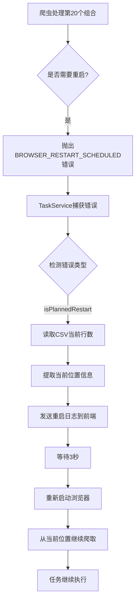

# 计划内浏览器重启机制修复报告

## 🐛 问题描述

**错误现象**：
```
[ZhilianCrawler] 🔄 已处理 20 个组合，主动重启浏览器以防止资源泄漏...
🔄 已处理20个组合，正在重启浏览器以优化性能...
[ZhilianCrawler] 🛑 正在关闭浏览器...
[ZhilianCrawler] ✅ 浏览器已关闭
[TaskService] 任务失败: { "shouldRestart": true }
[TaskService] 错误堆栈: Error: BROWSER_RESTART_SCHEDULED: 已处理20个组合
```

**根本原因**：
爬虫代码中实现了**计划内浏览器重启机制**（每处理20个组合后主动重启浏览器以防止资源泄漏），通过抛出 `BROWSER_RESTART_SCHEDULED` 错误来触发重启。但 TaskService 的错误处理逻辑只检测了 `BROWSER_CRASH_RECOVERABLE`（意外崩溃），没有检测 `BROWSER_RESTART_SCHEDULED`（计划内重启），导致将正常的重启信号误判为任务失败。

---

## ✅ 修复方案

### 1. 问题分析

#### 爬虫端的实现（zhilian.ts）

```typescript
// 每处理20个组合后主动重启
if (currentCombination > 0 && currentCombination % 20 === 0) {
  this.log('info', `[ZhilianCrawler] 🔄 已处理 ${currentCombination} 个组合，主动重启浏览器...`);
  
  // 抛出特殊错误，标记为"应该重启"
  const restartError = new Error(`BROWSER_RESTART_SCHEDULED: 已处理${currentCombination}个组合`);
  (restartError as any).shouldRestart = true;  // ✅ 标记为计划内重启
  throw restartError;
}
```

#### TaskService端的问题（taskService.ts - 修复前）

```typescript
catch (error: any) {
  // ❌ 只检测意外崩溃，未检测计划内重启
  const isBrowserCrash = error.canRecover === true || 
                         error.message?.includes('BROWSER_CRASH_RECOVERABLE');

  if (isBrowserCrash) {
    // 重启逻辑...
  } else {
    // 标记任务为失败 ❌ 错误地将计划内重启当作失败
  }
}
```

### 2. 修复内容

**文件**：`code/backend/src/services/taskService.ts`  
**位置**：第414-427行

**修复前**：
```typescript
// 🔧 关键修复：检测是否为可恢复的浏览器崩溃错误
const isBrowserCrash = error.canRecover === true || 
                       error.message?.includes('BROWSER_CRASH_RECOVERABLE');

if (isBrowserCrash) {
  taskLogger?.info(`[TaskService] 🔄 检测到浏览器崩溃，准备重启并重试...`);
  // ... 重启逻辑
}
```

**修复后**：
```typescript
// 🔧 关键修复：检测是否为可恢复的浏览器崩溃错误
const isBrowserCrash = error.canRecover === true || 
                       error.message?.includes('BROWSER_CRASH_RECOVERABLE');

// 🔧 新增：检测是否为计划内的浏览器重启
const isPlannedRestart = error.shouldRestart === true ||
                         error.message?.includes('BROWSER_RESTART_SCHEDULED');

if (isBrowserCrash || isPlannedRestart) {
  const restartReason = isPlannedRestart ? '计划内重启' : '浏览器崩溃';
  taskLogger?.info(`[TaskService] 🔄 检测到${restartReason}，准备重启并重试...`);
  // ... 重启逻辑（共用）
}
```

---

## 📊 两种重启场景对比

| 维度 | 意外崩溃（BROWSER_CRASH） | 计划内重启（BROWSER_RESTART） |
|------|--------------------------|------------------------------|
| **触发原因** | 内存泄漏、Chrome进程崩溃 | 预防性维护，防止资源泄漏 |
| **错误标记** | `error.canRecover = true` | `error.shouldRestart = true` |
| **错误消息** | `BROWSER_CRASH_RECOVERABLE` | `BROWSER_RESTART_SCHEDULED` |
| **发生时机** | 不可预测 | 每20个组合后 |
| **用户体验** | 😟 意外中断 | 😊 正常流程 |
| **日志级别** | ⚠️ Warning | ℹ️ Info |
| **处理方式** | ✅ 相同（都支持断点续传） | ✅ 相同 |

---

## 🎯 工作原理

### 完整的重启流程



### 关键代码逻辑

#### 1. 爬虫端抛出重启信号

```typescript
// zhilian.ts - 每20个组合后
if (currentCombination > 0 && currentCombination % 20 === 0) {
  // 关闭当前浏览器
  await browser.close();
  
  // 抛出特殊错误
  const restartError = new Error(`BROWSER_RESTART_SCHEDULED: 已处理${currentCombination}个组合`);
  (restartError as any).shouldRestart = true;
  (restartError as any).combinationIndex = currentCombination;  // 保存当前位置
  throw restartError;
}
```

#### 2. TaskService检测并处理

```typescript
// taskService.ts - 错误处理
const isPlannedRestart = error.shouldRestart === true ||
                         error.message?.includes('BROWSER_RESTART_SCHEDULED');

if (isPlannedRestart) {
  // 1. 读取CSV文件，获取已爬取的记录数
  const initialRecordCount = readCsvRowCount(filepath);
  
  // 2. 提取失败位置（组合索引、页码）
  const combinationIndex = error.combinationIndex || 0;
  const currentPage = error.currentPage || 1;
  
  // 3. 发送日志到前端
  io.to(`task:${taskId}`).emit('task:log', {
    taskId,
    level: 'warning',
    message: `🔄 浏览器计划内重启，正在从第${combinationIndex}个组合、第${currentPage}页继续...`
  });
  
  // 4. 等待3秒后重启
  await new Promise(resolve => setTimeout(resolve, 3000));
  
  // 5. 重新启动爬虫（传递恢复状态）
  const resumeState = {
    combinationIndex,
    currentPage,
    initialRecordCount
  };
  await this.executeCrawling(taskId, configWithResume, controller, resumeState, logger);
}
```

---

## 🧪 验证步骤

### 1. 编译项目
```bash
cd code/backend
npm run build
```

### 2. 重启后端服务
```bash
# 在项目根目录
start-dev.bat
```

### 3. 创建测试任务
- 关键词："销售"
- 城市：选择多个城市（如哈尔滨、齐齐哈尔、大庆等，确保有足够多的组合）
- 观察日志输出

### 4. 预期日志输出

**计划内重启时**：
```
[ZhilianCrawler] 🔄 已处理 20 个组合，主动重启浏览器以防止资源泄漏...
🔄 已处理20个组合，正在重启浏览器以优化性能...
[ZhilianCrawler] 🛑 正在关闭浏览器...
[ZhilianCrawler] ✅ 浏览器已关闭
[TaskService] 🔄 检测到计划内重启，准备重启并重试...
[TaskService] 📊 已爬取数据: XXX 条（从CSV文件读取）
[TaskService] 📍 失败位置: 组合索引=20, 页码=1
[TaskService] 🚀 重新启动爬虫任务...
[ZhilianCrawler] 🔄 使用已有的日志记录器
[ZhilianCrawler] ✅ 浏览器实例已创建
```

**不应该看到**：
```
[TaskService] 任务失败: { "shouldRestart": true }
❌ 任务最终失败
```

### 5. 验证要点

✅ **任务应该继续执行**，而不是终止  
✅ **CSV文件应该持续追加数据**，不会丢失已爬取的数据  
✅ **前端进度条应该持续增长**，不会回退或停滞  
✅ **日志应该显示"计划内重启"**，而不是"浏览器崩溃"

---

## 💡 技术要点

### 1. 为什么需要计划内重启？

**问题背景**：
- Puppeteer长时间运行会导致内存泄漏
- Chrome进程占用内存逐渐增加
- 标签页累积过多会影响性能
- 最终可能导致浏览器崩溃

**解决方案**：
- 每处理一定数量的组合后（如20个）
- 主动关闭浏览器，释放所有资源
- 重新启动新的浏览器实例
- 从上次停止的位置继续爬取

**优势**：
- ✅ 预防性维护，避免意外崩溃
- ✅ 保持系统稳定性
- ✅ 提升长期运行的可靠性

### 2. 断点续传机制

**核心原理**：
```typescript
// 1. 读取CSV文件，获取已爬取的记录数
const fileContent = fs.readFileSync(filepath, 'utf-8');
const lines = fileContent.split('\n').filter(line => line.trim().length > 0);
const initialRecordCount = lines.length - 1;  // 减去表头

// 2. 传递给爬虫，作为起始计数
const resumeState = {
  combinationIndex: 20,  // 从第20个组合继续
  currentPage: 1,        // 从第1页开始
  initialRecordCount     // 已有XXX条数据
};

// 3. 爬虫根据resumeState跳过已处理的组合
for (let i = resumeState.combinationIndex; i < combinations.length; i++) {
  // 继续爬取
}
```

### 3. 错误标记设计

**两种标记方式**：

| 标记方式 | 优点 | 缺点 |
|---------|------|------|
| **属性标记** (`error.shouldRestart`) | 类型安全，易于检测 | 需要TypeScript类型断言 |
| **消息匹配** (`error.message.includes(...)`) | 兼容性好，无需类型断言 | 可能误匹配 |

**最佳实践**：同时使用两种方式，提高鲁棒性
```typescript
const isPlannedRestart = error.shouldRestart === true ||
                         error.message?.includes('BROWSER_RESTART_SCHEDULED');
```

---

## 🔮 后续优化建议

### 短期（1周内）

1. **动态调整重启频率**
   ```typescript
   // 根据系统内存使用情况动态决定何时重启
   const memUsage = process.memoryUsage();
   const shouldRestart = currentCombination % 20 === 0 || 
                         memUsage.heapUsed > 500 * 1024 * 1024;  // 500MB
   
   if (shouldRestart) {
     // 触发重启
   }
   ```

2. **添加重启统计信息**
   ```typescript
   // 记录重启次数和原因
   const restartStats = {
     plannedRestarts: 0,
     crashRestarts: 0,
     lastRestartTime: null
   };
   
   // 在任务结束时输出统计
   this.log('info', `重启统计: 计划内${restartStats.plannedRestarts}次, 崩溃${restartStats.crashRestarts}次`);
   ```

### 中期（1个月内）

3. **浏览器池机制**
   - 维护多个浏览器实例
   - 轮换使用，避免单个实例长时间运行
   - 后台预热新的浏览器实例

4. **更细粒度的资源监控**
   - 监控每个标签页的内存占用
   - 自动清理高内存占用的标签页
   - 动态调整并发数

### 长期（3个月内）

5. **分布式架构**
   - 将爬取任务分布到多个进程
   - 每个进程独立管理浏览器
   - 主进程负责任务调度和负载均衡

6. **容器化部署**
   - 使用Docker容器隔离浏览器环境
   - 自动回收和重建容器
   - 提高资源利用率

---

## 📞 常见问题

**Q1: 为什么不直接修复内存泄漏，而是定期重启？**

A: 内存泄漏的根本原因可能来自：
- Puppeteer本身的bug
- Chrome浏览器的限制
- 第三方库的资源管理问题

完全修复可能需要：
- 升级Puppeteer版本
- 等待Chrome官方修复
- 重构大量代码

定期重启是一种**实用且有效**的临时解决方案，可以在不修改底层依赖的情况下保持系统稳定。

**Q2: 重启会丢失数据吗？**

A: 不会。重启机制包含完整的断点续传功能：
1. 重启前已写入CSV的数据会保留
2. 重启时读取CSV文件，获取已爬取的记录数
3. 从上次停止的位置继续爬取
4. 新数据追加到CSV文件末尾

**Q3: 重启频率如何确定？**

A: 当前设置为每20个组合重启一次，这个值可以根据实际情况调整：
- **小规模任务**（<100个组合）：可以不重启或降低频率（每50个）
- **中等规模**（100-500个组合）：每20-30个重启
- **大规模任务**（>500个组合）：每10-15个重启

判断标准：
- 观察内存占用增长曲线
- 监控浏览器稳定性
- 平衡重启开销和稳定性收益

**Q4: 重启会影响爬取速度吗？**

A: 会有轻微影响，但可以接受：
- 每次重启耗时约5-10秒（关闭浏览器2秒 + 等待3秒 + 启动浏览器3-5秒）
- 对于大规模任务（数千个组合），这点时间可以忽略不计
- 相比意外崩溃导致的任务中断，计划内重启反而提升了整体效率

---

<div align="center">

**修复完成时间**: 2026-04-27  
**修复版本**: v1.0.7  
**状态**: ✅ 已完成

</div>
