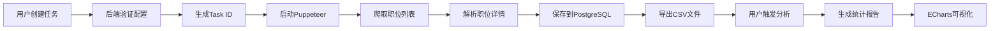

# 智能招聘数据爬虫系统

<div align="center">


**基于AI辅助开发的职位数据采集与分析平台**

[功能特性](#-功能特性) • [快速开始](#-快速开始) • [系统架构](#-系统架构) • [使用文档](#-使用文档) • [开发指南](#-开发指南)

</div>

---

## 📋 目录

- [项目简介](#-项目简介)
- [功能特性](#-功能特性)
- [技术栈](#-技术栈)
- [系统架构](#-系统架构)
- [项目结构](#-项目结构)
- [环境要求](#-环境要求)
- [快速开始](#-快速开始)
- [部署说明](#-部署说明)
- [使用指南](#-使用指南)
- [API文档](#-api文档)
- [开发指南](#-开发指南)
- [常见问题](#-常见问题)
- [许可证](#-许可证)

---

## 🎯 项目简介

**智能招聘数据爬虫系统**是一个集职位数据采集、存储、分析和可视化于一体的全栈应用。系统支持从主流招聘平台（智联招聘、前程无忧）自动爬取职位信息，提供强大的数据分析能力和直观的可视化展示。

### 核心价值

- 🤖 **自动化采集**：支持多关键词、多城市组合的批量任务配置
- 📊 **智能分析**：自动生成薪资分布、城市热度、经验要求等多维度洞察
- 📈 **可视化展示**：丰富的图表类型（饼图、柱状图、漏斗图等）直观呈现数据
- 🔐 **安全认证**：集成OAuth2授权码模式，保障系统访问安全
- ⚡ **实时监控**：WebSocket实时推送任务进度和日志

### 适用场景

- 人力资源市场调研
- 薪酬水平分析
- 就业趋势研究
- 人才需求预测
- AI编程培训实战项目

---

## ✨ 功能特性

### 1. 爬虫管理模块

#### 任务创建与配置
- ✅ 支持多关键词组合搜索
- ✅ 支持多城市/省份选择
- ✅ 可指定目标企业列表过滤
- ✅ 自定义最大爬取页数
- ✅ 智能去重机制

#### 任务监控
- ✅ 实时进度显示（百分比+当前页码）
- ✅ 动态日志输出（彩色分级显示）
- ✅ 任务控制（启动/暂停/恢复/停止）
- ✅ 异常处理与重试机制
- ✅ 多任务并发执行

#### 数据来源
- 🏢 **智联招聘**：深度解析职位详情页
- 💼 **前程无忧**：智能提取结构化数据
- 🔄 可扩展支持更多平台

### 2. 文件管理模块

#### CSV导出
- ✅ 自动保存为UTF-8编码CSV文件
- ✅ 包含完整字段信息（职位名称、企业、薪资、城市等）
- ✅ 支持按任务ID查询和下载
- ✅ 文件大小和记录数统计

#### 文件预览
- ✅ 在线查看前100条数据
- ✅ 表格化展示，支持横向滚动
- ✅ 自动识别表头和数据类型

### 3. 智能分析模块

#### 基础统计分析
- 📋 总记录数、字段数量、空值率
- ⭐ 数据质量评分（满分100分）
- 📑 唯一值统计、Top值频率分布

#### 专项深度分析
- 💰 **薪资分析**：
  - 平均/中位薪资计算
  - 6档薪资区间分布（5K以下至20K+）
  - 薪资格式智能解析（K/万单位转换）

- 🌆 **城市集中度**：
  - TOP10热门城市排名
  - 岗位占比百分比
  - 地域分布热力图

- 🎓 **学历门槛分析**：
  - 本科及以上要求比例
  - 各学历要求分布

- 💼 **经验友好度**：
  - 应届生/初级岗位比例
  - 经验年限分布

- 🏭 **企业性质分布**：
  - 民营/国企/外企/上市公司占比

- 📏 **公司规模分析**：
  - 不同规模企业招聘需求对比

#### 智能洞察系统
自动生成数据洞察报告，包含：
- 🔵 市场平均薪资水平
- 🟢 城市集中度分析
- 🟠 就业友好度评估
- 🔴 学历门槛警示

### 4. 用户认证模块

#### OAuth2集成
- ✅ 授权码模式（Authorization Code Flow）
- ✅ Token自动刷新机制
- ✅ Cookie-based会话管理
- ✅ 路由守卫保护

#### 权限控制
- ✅ 登录状态持久化
- ✅ 未认证自动跳转登录页
- ✅ API路径代理转发

---

## 🛠️ 技术栈

### 前端技术

| 技术 | 版本 | 用途 |
|------|------|------|
| Vue 3 | ^3.5.32 | 核心框架（Composition API） |
| TypeScript | ~6.0.2 | 类型安全 |
| Vite | ^8.0.4 | 构建工具 |
| Element Plus | ^2.13.7 | UI组件库 |
| Pinia | ^3.0.4 | 状态管理 |
| Vue Router | ^4.6.4 | 路由管理 |
| Axios | ^1.15.0 | HTTP客户端 |
| Socket.IO Client | ^4.8.3 | WebSocket通信 |
| ECharts | ^6.0.0 | 数据可视化 |

### 后端技术

| 技术 | 版本 | 用途 |
|------|------|------|
| Node.js | >=18.0 | 运行时环境 |
| Express | ^4.18.2 | Web框架 |
| TypeScript | ^5.3.3 | 类型安全 |
| PostgreSQL | >=14 | 关系型数据库 |
| pg | ^8.20.0 | PostgreSQL驱动 |
| Puppeteer | ^24.41.0 | 浏览器自动化（爬虫） |
| Socket.IO | ^4.7.2 | 实时通信 |
| Cheerio | ^1.0.0-rc.12 | HTML解析 |
| csv-parser | ^3.0.0 | CSV解析 |
| csv-writer | ^1.6.0 | CSV生成 |
| UUID | ^9.0.1 | 唯一标识符生成 |
| Day.js | ^1.11.10 | 日期处理 |

### 开发工具

- **代码编辑器**：VS Code
- **包管理器**：npm
- **版本控制**：Git
- **API测试**：Postman / curl
- **数据库管理**：pgAdmin / DBeaver

---

## 🏗️ 系统架构

### 整体架构图

```
┌─────────────────────────────────────────────────────┐
│                    前端层 (Vue 3)                     │
│  ┌──────────┐ ┌──────────┐ ┌──────────┐ ┌────────┐ │
│  │ 爬虫管理  │ │ 文件管理  │ │ 数据分析  │ │ 用户中心│ │
│  └──────────┘ └──────────┘ └──────────┘ └────────┘ │
└──────────────────────┬──────────────────────────────┘
                       │ HTTP + WebSocket
┌──────────────────────▼──────────────────────────────┐
│                  后端层 (Express)                     │
│  ┌──────────┐ ┌──────────┐ ┌──────────┐ ┌────────┐ │
│  │ Task API │ │ File API │ │Analysis  │ │ Auth   │ │
│  │          │ │          │ │   API    │ │  API   │ │
│  └──────────┘ └──────────┘ └──────────┘ └────────┘ │
└──────────────────────┬──────────────────────────────┘
                       │ SQL Query
┌──────────────────────▼──────────────────────────────┐
│                数据层 (PostgreSQL)                    │
│  ┌──────────┐ ┌──────────┐ ┌──────────┐            │
│  │  tasks   │ │  files   │ │ job_data │            │
│  └──────────┘ └──────────┘ └──────────┘            │
└─────────────────────────────────────────────────────┘
                       │ Browser Automation
┌──────────────────────▼──────────────────────────────┐
│              外部服务 (Puppeteer)                     │
│  ┌──────────────┐  ┌──────────────┐                 │
│  │  智联招聘     │  │  前程无忧     │                 │
│  └──────────────┘  └──────────────┘                 │
└─────────────────────────────────────────────────────┘
```

### 数据流图



### 关键设计模式

1. **观察者模式**：WebSocket实时推送任务进度
2. **策略模式**：不同招聘平台的爬虫策略
3. **工厂模式**：动态创建爬虫实例
4. **单例模式**：数据库连接池管理

---

## 📁 项目结构

```
aitraining/
├── doc/                          # 项目文档（AI训练材料）
│   ├── 01-AI入口.md             # AI Agent入口文档
│   ├── 02-需求和项目介绍/        # 需求分析文档
│   ├── 03-技术架构设计/          # 架构设计文档
│   ├── 04-功能详细设计/          # 功能设计文档
│   ├── 05-测试用例设计/          # 测试文档
│   ├── 06-开发参考/              # 技术参考文档
│   ├── 07-开发规范/              # 代码规范
│   └── 08-项目进度/              # 项目管理文档
│
├── code/                         # 源代码
│   ├── frontend/                 # 前端项目
│   │   ├── src/
│   │   │   ├── api/             # API接口封装
│   │   │   │   ├── index.ts     # Axios实例配置
│   │   │   │   ├── task.ts      # 任务相关API
│   │   │   │   ├── file.ts      # 文件相关API
│   │   │   │   └── auth.ts      # 认证相关API
│   │   │   ├── assets/          # 静态资源
│   │   │   ├── components/      # 通用组件
│   │   │   ├── layouts/         # 布局组件
│   │   │   │   └── MainLayout.vue  # 主布局（侧边栏+顶栏）
│   │   │   ├── router/          # 路由配置
│   │   │   │   └── index.ts     # 路由定义+守卫
│   │   │   ├── stores/          # Pinia状态管理
│   │   │   │   ├── user.ts      # 用户状态
│   │   │   │   └── crawler.ts   # 爬虫状态（含WebSocket）
│   │   │   ├── utils/           # 工具函数
│   │   │   │   └── auth.ts      # 认证工具
│   │   │   ├── views/           # 页面组件
│   │   │   │   ├── Home.vue     # 首页（待实现）
│   │   │   │   ├── Login.vue    # 登录页
│   │   │   │   ├── AuthCallback.vue  # OAuth2回调页
│   │   │   │   ├── About.vue    # 关于页
│   │   │   │   ├── crawler/     # 爬虫管理模块
│   │   │   │   │   ├── Index.vue       # 任务列表
│   │   │   │   │   ├── CreateTask.vue  # 创建任务
│   │   │   │   │   ├── EditTask.vue    # 编辑任务
│   │   │   │   │   └── TaskMonitor.vue # 任务监控
│   │   │   │   ├── files/       # 文件管理模块
│   │   │   │   │   └── Index.vue       # 文件列表+预览
│   │   │   │   └── analysis/    # 数据分析模块
│   │   │   │       └── Index.vue       # 分析结果展示
│   │   │   ├── App.vue          # 根组件
│   │   │   └── main.ts          # 应用入口
│   │   ├── public/              # 公共静态文件
│   │   ├── .env                 # 环境变量
│   │   ├── vite.config.ts       # Vite配置（含代理）
│   │   ├── tsconfig.json        # TypeScript配置
│   │   └── package.json         # 依赖配置
│   │
│   ├── backend/                  # 后端项目
│   │   ├── src/
│   │   │   ├── config/          # 配置文件
│   │   │   │   └── database.ts  # 数据库连接配置
│   │   │   ├── controllers/     # 控制器
│   │   │   │   ├── taskController.ts    # 任务控制器
│   │   │   │   ├── fileController.ts    # 文件控制器
│   │   │   │   ├── analysisController.ts # 分析控制器
│   │   │   │   └── authController.ts    # 认证控制器
│   │   │   ├── routes/          # 路由定义
│   │   │   │   ├── taskRoutes.ts
│   │   │   │   ├── fileRoutes.ts
│   │   │   │   ├── analysisRoutes.ts
│   │   │   │   └── authRoutes.ts
│   │   │   ├── services/        # 业务逻辑
│   │   │   │   ├── taskService.ts       # 任务服务
│   │   │   │   ├── authService.ts       # 认证服务
│   │   │   │   └── crawler/     # 爬虫服务
│   │   │   │       ├── zhilian.ts       # 智联招聘爬虫
│   │   │   │       └── job51.ts         # 前程无忧爬虫
│   │   │   ├── middleware/      # 中间件
│   │   │   │   └── errorHandler.ts      # 错误处理
│   │   │   ├── types/           # 类型定义
│   │   │   │   └── index.ts     # 通用类型
│   │   │   ├── app.ts           # Express应用配置
│   │   │   └── index.ts         # 服务器入口
│   │   ├── data/                # 数据存储
│   │   │   └── csv/             # CSV导出目录
│   │   ├── logs/                # 日志目录
│   │   ├── dist/                # 编译输出
│   │   ├── tsconfig.json        # TypeScript配置
│   │   └── package.json         # 依赖配置
│   │
│   ├── sql/                     # 数据库脚本
│   │   └── init.sql             # 初始化SQL
│   └── test/                    # 测试脚本
│
├── .gitignore                   # Git忽略配置
├── README.md                    # 项目说明（本文件）
├── start-dev.bat                # Windows启动脚本
├── stop-dev.bat                 # Windows停止脚本
└── clean-and-start.bat          # 清理并重启脚本
```

### 核心文件说明

| 文件路径 | 作用 | 关键技术点 |
|---------|------|-----------|
| `frontend/src/stores/crawler.ts` | 爬虫状态管理 | Pinia + WebSocket + Map响应式 |
| `backend/src/services/crawler/zhilian.ts` | 智联招聘爬虫 | Puppeteer + 反爬策略 + 重试机制 |
| `backend/src/controllers/fileController.ts` | 文件分析控制器 | CSV解析 + 统计分析 + 智能洞察 |
| `frontend/src/views/analysis/Index.vue` | 数据分析页面 | ECharts 7种图表 + 响应式设计 |
| `backend/src/app.ts` | 后端应用入口 | Express + Socket.IO + CORS配置 |
| `frontend/vite.config.ts` | Vite配置 | API代理 + SPA fallback |

---

## 💻 环境要求

### 必需软件

| 软件 | 最低版本 | 推荐版本 | 下载地址 |
|------|---------|---------|---------|
| Node.js | 18.0 | 20.x LTS | https://nodejs.org/ |
| PostgreSQL | 14 | 16.x | https://www.postgresql.org/ |
| Git | 2.0 | 最新版 | https://git-scm.com/ |
| Chrome/Chromium | 最新版 | 最新版 | Puppeteer自动下载 |

### 可选工具

- **VS Code**：推荐代码编辑器
- **pgAdmin 4**：PostgreSQL图形化管理工具
- **Postman**：API测试工具
- **DBeaver**：通用数据库管理工具

### 系统要求

- **操作系统**：Windows 10/11, macOS 10.15+, Linux (Ubuntu 20.04+)
- **内存**：至少8GB RAM（推荐16GB，Puppeteer较耗内存）
- **磁盘空间**：至少5GB可用空间

---

## 🚀 快速开始

### 1. 克隆项目

```bash
git clone git@github.com:liangwenqing1984/aitraining-project.git
cd aitraining
```

### 2. 安装依赖

#### 前端依赖
```bash
cd code/frontend
npm install
```

#### 后端依赖
```bash
cd ../backend
npm install
```

### 3. 配置数据库

#### 创建数据库和用户
```sql
-- 连接到PostgreSQL
psql -U postgres

-- 创建数据库
CREATE DATABASE training_exercises;

-- 创建用户（如果不存在）
CREATE USER liangwenqing WITH PASSWORD 'liangwenqing';

-- 授权
GRANT ALL PRIVILEGES ON DATABASE training_exercises TO liangwenqing;

-- 切换到该数据库
\c training_exercises

-- 创建schema
CREATE SCHEMA IF NOT EXISTS liangwenqing;
GRANT ALL ON SCHEMA liangwenqing TO liangwenqing;
```

#### 初始化表结构
```bash
# 执行初始化SQL脚本
psql -U liangwenqing -d training_exercises -f code/sql/init.sql
```

#### 修改后端配置
编辑 `code/backend/src/config/database.ts`：

```typescript
export const dbConfig = {
  host: '10.1.1.113',        // 修改为你的PostgreSQL服务器IP
  port: 7300,                 // 修改为你的端口
  database: 'training_exercises',
  schema: 'liangwenqing',
  user: 'liangwenqing',
  password: 'liangwenqing'
}
```

### 4. 配置OAuth2认证（可选）

如果需要启用OAuth2登录，需配置Auth服务：

编辑 `code/backend/.env`（如不存在则创建）：

```env
# OAuth2配置
AUTH_SERVER_URL=http://your-auth-server.com
CLIENT_ID=your-client-id
CLIENT_SECRET=your-client-secret
REDIRECT_URI=http://localhost:3000/api/auth/callback
```

> **注意**：如果不配置OAuth2，系统默认使用简单登录模式（任意用户名密码均可登录）。

### 5. 启动服务

#### 方式一：使用批处理脚本（Windows推荐）

```bash
# 在项目根目录执行
start-dev.bat
```

此脚本会同时启动前端和后端服务。

#### 方式二：手动启动

**终端1 - 启动后端：**
```bash
cd code/backend
npm run dev
```

**终端2 - 启动前端：**
```bash
cd code/frontend
npm run dev
```

### 6. 访问系统

打开浏览器访问：http://localhost:3000

- **默认账号**：任意用户名/密码（未配置OAuth2时）
- **OAuth2账号**：联系管理员获取

---

## 📦 部署说明

### 开发环境部署

上述"快速开始"即为开发环境部署，适合本地开发和测试。

### 生产环境部署

#### 1. 前端构建

```bash
cd code/frontend
npm run build
```

构建产物位于 `code/frontend/dist/` 目录。

#### 2. 后端构建

```bash
cd code/backend
npm run build
```

编译产物位于 `code/backend/dist/` 目录。

#### 3. 使用PM2部署（推荐）

安装PM2：
```bash
npm install -g pm2
```

创建 `ecosystem.config.js`：

```javascript
module.exports = {
  apps: [
    {
      name: 'aitraining-backend',
      script: './code/backend/dist/index.js',
      instances: 2,
      exec_mode: 'cluster',
      env: {
        NODE_ENV: 'production',
        PORT: 3004
      }
    }
  ]
}
```

启动服务：
```bash
pm2 start ecosystem.config.js
pm2 save
pm2 startup
```

#### 4. 使用Nginx反向代理

创建 `/etc/nginx/sites-available/aitraining`：

```nginx
server {
    listen 80;
    server_name your-domain.com;

    # 前端静态文件
    location / {
        root /path/to/code/frontend/dist;
        try_files $uri $uri/ /index.html;
    }

    # 后端API代理
    location /api/ {
        proxy_pass http://localhost:3004;
        proxy_http_version 1.1;
        proxy_set_header Upgrade $http_upgrade;
        proxy_set_header Connection 'upgrade';
        proxy_set_header Host $host;
        proxy_cache_bypass $http_upgrade;
    }

    # WebSocket代理
    location /socket.io/ {
        proxy_pass http://localhost:3004;
        proxy_http_version 1.1;
        proxy_set_header Upgrade $http_upgrade;
        proxy_set_header Connection "upgrade";
        proxy_set_header Host $host;
    }
}
```

启用配置：
```bash
sudo ln -s /etc/nginx/sites-available/aitraining /etc/nginx/sites-enabled/
sudo nginx -t
sudo systemctl restart nginx
```

#### 5. Docker部署（可选）

创建 `Dockerfile.backend`：

```dockerfile
FROM node:20-alpine

WORKDIR /app

COPY code/backend/package*.json ./
RUN npm ci --only=production

COPY code/backend/dist ./dist
COPY code/backend/data ./data

EXPOSE 3004

CMD ["node", "dist/index.js"]
```

创建 `Dockerfile.frontend`：

```dockerfile
FROM node:20-alpine AS builder

WORKDIR /app
COPY code/frontend/package*.json ./
RUN npm ci

COPY code/frontend ./
RUN npm run build

FROM nginx:alpine
COPY --from=builder /app/dist /usr/share/nginx/html
COPY nginx.conf /etc/nginx/conf.d/default.conf

EXPOSE 80
CMD ["nginx", "-g", "daemon off;"]
```

---

## 📖 使用指南

### 1. 创建爬虫任务

#### 步骤1：进入爬虫管理
点击左侧菜单 **"爬虫管理"** → 点击右上角 **"创建任务"**

#### 步骤2：填写任务配置

**基本信息：**
- **任务名称**：例如 "Java开发工程师-北京上海"
- **数据来源**：选择智联招聘 / 前程无忧 / 全部

**搜索条件：**
- **职位关键词**：输入关键词后**必须点击"添加"按钮**或按回车键
  - 示例：`Java开发`、`前端工程师`、`产品经理`
  - 支持多个关键词，系统会分别爬取
  
- **城市/省份**：选择目标城市
  - 示例：`北京`、`上海`、`深圳`
  - 支持多选，系统会生成所有组合

**高级选项：**
- **目标企业**（可选）：指定企业名称列表，只采集这些企业的职位
- **最大页数**：每个关键词×城市组合最多爬取的页数（默认10页）

#### 步骤3：提交任务
点击 **"创建"** 按钮，系统会：
1. 验证配置合法性
2. 生成唯一的Task ID
3. 在数据库中创建任务记录
4. 自动跳转到任务监控页面

### 2. 监控任务执行

#### 实时进度
- **进度条**：显示当前完成百分比
- **当前采集**：已处理的职位数量
- **已保存记录**：成功存入数据库的数量

#### 实时日志
日志分为四个级别：
- 🔵 **INFO**（蓝色）：常规信息，如"正在请求第X页"
- 🟢 **SUCCESS**（绿色）：成功操作，如"已采集50条"
- 🟠 **WARNING**（橙色）：警告信息，如"检测到反爬机制"
- 🔴 **ERROR**（红色）：错误信息，如"请求失败"

#### 任务控制
- **暂停**：临时停止爬取，保留当前进度
- **恢复**：从中断处继续执行
- **停止**：完全终止任务，无法恢复

### 3. 查看采集结果

#### 步骤1：进入文件管理
点击左侧菜单 **"文件管理"**

#### 步骤2：浏览文件列表
系统会为每个完成的任务生成一个CSV文件，显示：
- 文件名（格式：`task_{taskId}_{timestamp}.csv`）
- 文件大小
- 记录数量
- 创建时间

#### 步骤3：预览数据
点击文件行的 **"预览"** 按钮，可查看前100条数据的表格视图。

#### 步骤4：下载文件
点击 **"下载"** 按钮，将CSV文件保存到本地。

### 4. 数据分析

#### 步骤1：触发分析
在文件管理页面，点击文件行的 **"分析"** 按钮，或直接进入 **"数据分析"** 页面。

#### 步骤2：查看统计卡片
页面顶部显示4个关键指标：
- 📋 **总记录数**：CSV文件中的行数
- 📑 **字段数量**：数据列数
- ⭐ **数据质量评分**：综合评分（满分100）
- 🕒 **分析时间**：分析完成的时间戳

#### 步骤3：阅读智能洞察
系统自动生成4类洞察：
- 💰 薪资水平分析
- 🌆 城市集中度
- 🎓 学历门槛
- 💼 经验要求

#### 步骤4：查看图表
系统自动生成最多7个图表：

1. **薪资分布图**（环形饼图）
   - 6个薪资区间
   - 悬停显示具体数量和百分比

2. **城市分布图**（横向柱状图）
   - TOP10热门城市
   - 按岗位数量降序排列

3. **职位分布图**（横向柱状图）
   - TOP10常见职位
   - 便于发现高频招聘岗位

4. **经验分布图**（饼图）
   - 不同经验要求的占比

5. **学历分布图**（南丁格尔玫瑰图）
   - 各学历层次的视觉化展示

6. **企业性质图**（饼图）
   - 民营/国企/外企等分布

7. **公司规模图**（环形图）
   - 不同规模企业的招聘需求

#### 步骤5：导出数据洞察
目前支持截图保存，未来版本将支持导出PDF报告。

### 5. 编辑已有任务

#### 步骤1：找到目标任务
在任务列表中，找到需要修改的任务。

#### 步骤2：进入编辑页面
点击 **"配置"** 按钮，进入任务编辑页面。

#### 步骤3：修改配置
可以修改以下内容：
- 任务名称
- 关键词列表
- 城市列表
- 目标企业
- 最大页数

> **注意**：修改配置后重新提交，会创建一个新任务，原任务保持不变。

#### 步骤4：重新启动
点击 **"保存并启动"**，系统会用新配置创建任务并开始执行。

---

## 🔌 API文档

### 基础信息

- **Base URL**: `http://localhost:3004/api`
- **Content-Type**: `application/json`
- **认证方式**: Cookie-based Session

### 任务管理API

#### 1. 创建任务
```http
POST /api/tasks
Content-Type: application/json

{
  "name": "Java开发工程师-北京",
  "source": "zhilian",
  "config": {
    "keywords": ["Java开发", "后端工程师"],
    "cities": ["北京", "上海"],
    "companies": [],
    "maxPages": 10
  }
}
```

**响应：**
```json
{
  "success": true,
  "data": {
    "taskId": "uuid-xxx-xxx",
    "message": "任务创建成功"
  }
}
```

#### 2. 获取任务列表
```http
GET /api/tasks?page=1&pageSize=10&status=running
```

**响应：**
```json
{
  "success": true,
  "data": {
    "list": [...],
    "total": 50,
    "page": 1,
    "pageSize": 10
  }
}
```

#### 3. 获取任务详情
```http
GET /api/tasks/:taskId
```

#### 4. 启动任务
```http
POST /api/tasks/:taskId/start
```

#### 5. 暂停任务
```http
POST /api/tasks/:taskId/pause
```

#### 6. 恢复任务
```http
POST /api/tasks/:taskId/resume
```

#### 7. 停止任务
```http
POST /api/tasks/:taskId/stop
```

#### 8. 删除任务
```http
DELETE /api/tasks/:taskId
```

### 文件管理API

#### 1. 获取文件列表
```http
GET /api/files?page=1&pageSize=10&keyword=test
```

#### 2. 获取文件详情
```http
GET /api/files/:fileId
```

#### 3. 预览文件内容
```http
GET /api/files/:fileId/preview?limit=100
```

**响应：**
```json
{
  "success": true,
  "data": {
    "headers": ["职位名称", "企业名称", "薪资", ...],
    "rows": [
      ["Java开发工程师", "某某科技公司", "15-20K", ...],
      ...
    ],
    "total": 1234
  }
}
```

#### 4. 下载文件
```http
GET /api/files/:fileId/download
```

### 数据分析API

#### 1. 分析文件
```http
POST /api/analysis/:fileId
```

**响应：**
```json
{
  "success": true,
  "data": {
    "basicStats": {
      "totalRecords": 1234,
      "fieldCount": 15,
      "qualityScore": 85
    },
    "salaryAnalysis": {
      "average": 15000,
      "median": 14000,
      "distribution": [...]
    },
    "insights": [
      {
        "type": "salary",
        "icon": "💰",
        "title": "市场平均薪资",
        "content": "当前市场平均薪资为 15000 元/月",
        "level": "info"
      }
    ],
    "fieldStats": {
      "城市": {
        "topValues": [
          {"value": "北京", "count": 456, "percentage": 36.9}
        ]
      }
    }
  }
}
```

### 认证API

#### 1. 登录
```http
POST /api/auth/login
Content-Type: application/json

{
  "username": "test",
  "password": "test123"
}
```

#### 2. 登出
```http
POST /api/auth/logout
```

#### 3. 获取当前用户
```http
GET /api/auth/me
```

### WebSocket事件

#### 客户端 → 服务端

```javascript
// 订阅任务更新
socket.emit('task:subscribe', { taskId: 'uuid-xxx' });

// 取消订阅
socket.emit('task:unsubscribe', { taskId: 'uuid-xxx' });
```

#### 服务端 → 客户端

```javascript
// 任务进度更新
socket.on('task:progress', (data) => {
  console.log(`进度: ${data.progress}%`);
});

// 任务状态变更
socket.on('task:status', (data) => {
  console.log(`状态: ${data.status}`);
});

// 实时日志
socket.on('task:log', (data) => {
  console.log(`[${data.level}] ${data.message}`);
});

// 任务完成
socket.on('task:completed', (data) => {
  console.log(`完成！共采集 ${data.totalRecords} 条数据`);
});

// 任务错误
socket.on('task:error', (data) => {
  console.error(`错误: ${data.error}`);
});
```

---

## 👨‍💻 开发指南

### 前端开发

#### 项目结构规范

```
src/
├── api/          # API接口层（按模块划分）
├── assets/       # 静态资源（图片、样式）
├── components/   # 通用组件（可复用）
├── layouts/      # 布局组件
├── router/       # 路由配置
├── stores/       # Pinia状态管理
├── utils/        # 工具函数
└── views/        # 页面组件（按模块组织）
```

#### 命名规范

- **组件文件**：PascalCase（如 `TaskMonitor.vue`）
- **工具函数**：camelCase（如 `formatDate.ts`）
- **常量**：UPPER_SNAKE_CASE（如 `MAX_RETRY_COUNT`）
- **变量/函数**：camelCase（如 `getUserInfo`）

#### 状态管理规范

使用Pinia Store管理全局状态：

```typescript
// stores/crawler.ts
export const useCrawlerStore = defineStore('crawler', () => {
  const tasks = ref<Task[]>([])
  const currentTask = ref<Task | null>(null)
  
  // 计算属性
  const runningTasks = computed(() => 
    tasks.value.filter(t => t.status === 'running')
  )
  
  // 方法
  async function loadTasks() {
    const res = await taskApi.getTasks()
    tasks.value = res.data.list
  }
  
  return { tasks, currentTask, runningTasks, loadTasks }
})
```

#### API调用规范

统一使用Axios拦截器处理错误：

```typescript
// api/task.ts
export const taskApi = {
  async createTask(config: TaskConfig) {
    const res = await axios.post('/api/tasks', config)
    return res.data
  }
}
```

### 后端开发

#### 项目结构规范

```
src/
├── config/       # 配置文件
├── controllers/  # 控制器（处理HTTP请求）
├── routes/       # 路由定义
├── services/     # 业务逻辑层
├── middleware/   # 中间件
├── types/        # TypeScript类型定义
└── utils/        # 工具函数
```

#### 控制器规范

```typescript
// controllers/taskController.ts
export const createTask = async (req: Request, res: Response) => {
  try {
    const config = req.body
    const result = await taskService.createTask(config)
    res.json({ success: true, data: result })
  } catch (error) {
    next(error) // 交给错误处理中间件
  }
}
```

#### 服务层规范

```typescript
// services/taskService.ts
export class TaskService {
  async createTask(config: TaskConfig): Promise<Task> {
    // 1. 验证配置
    this.validateConfig(config)
    
    // 2. 生成Task ID
    const taskId = uuidv4()
    
    // 3. 保存到数据库
    await db.query('INSERT INTO tasks ...', [taskId, ...])
    
    // 4. 启动爬虫
    this.startCrawler(taskId, config)
    
    return { id: taskId, ... }
  }
}
```

#### 数据库操作规范

使用参数化查询防止SQL注入：

```typescript
// ❌ 错误示范
await db.query(`SELECT * FROM tasks WHERE id = '${taskId}'`)

// ✅ 正确示范
await db.query('SELECT * FROM tasks WHERE id = $1', [taskId])
```

### 爬虫开发

#### 新增招聘平台支持

1. 创建爬虫类：

```typescript
// services/crawler/newplatform.ts
export class NewPlatformCrawler {
  async crawl(config: TaskConfig): AsyncGenerator<JobData> {
    const browser = await puppeteer.launch()
    try {
      // 实现爬取逻辑
      yield jobData
    } finally {
      await browser.close()
    }
  }
}
```

2. 注册到任务服务：

```typescript
// services/taskService.ts
if (config.source === 'newplatform') {
  crawler = new NewPlatformCrawler()
}
```

#### 反爬策略

- **随机延迟**：每次请求间隔2-5秒
- **User-Agent轮换**：模拟不同浏览器
- **资源拦截**：阻止图片、CSS等非必要资源
- **重试机制**：失败后最多重试2次
- **超时控制**：单页加载不超过60秒

### 调试技巧

#### 前端调试

1. **Vue DevTools**：安装浏览器扩展
2. **Console日志**：使用 `[Module]` 前缀区分模块
   ```typescript
   console.log('[TaskMonitor] 当前任务:', task)
   ```
3. **Network面板**：检查API请求和响应

#### 后端调试

1. **日志输出**：使用颜色区分级别
   ```typescript
   console.log('\x1b[32m%s\x1b[0m', '[SUCCESS] 任务启动')
   ```
2. **断点调试**：使用 `tsx watch` 支持热重载
3. **Postman测试**：直接调用API接口

---

## ❓ 常见问题

### 1. 任务创建失败

**问题**：点击"创建"按钮后无响应或报错。

**解决方案**：
- ✅ 确认关键词已点击"添加"按钮（不是仅输入文本）
- ✅ 检查后端服务是否正常运行（`http://localhost:3004/api/health`）
- ✅ 查看浏览器控制台是否有CORS错误
- ✅ 检查PostgreSQL数据库连接是否正常

### 2. 爬虫无法获取数据

**问题**：任务显示"运行中"但长时间无进度。

**解决方案**：
- ✅ 检查网络连接是否正常
- ✅ 查看实时日志是否有反爬提示
- ✅ 尝试减少并发任务数量
- ✅ 检查Chrome/Chromium是否正确安装
  ```bash
  cd code/backend
  npx puppeteer browsers install chrome
  ```

### 3. 数据分析页面空白

**问题**：点击"分析"后没有图表显示。

**解决方案**：
- ✅ 确认CSV文件包含有效数据（至少10条记录）
- ✅ 检查文件编码是否为UTF-8
- ✅ 查看浏览器控制台是否有ECharts错误
- ✅ 确认字段名称匹配（如"职位名称"、"薪资"等）

### 4. WebSocket连接失败

**问题**：任务监控页面无法接收实时更新。

**解决方案**：
- ✅ 检查后端Socket.IO配置中的CORS设置
- ✅ 确认防火墙未阻止3004端口
- ✅ 查看浏览器控制台WebSocket连接日志
- ✅ 重启后端服务

### 5. OAuth2登录失败

**问题**：登录后跳转回首页但未显示用户信息。

**解决方案**：
- ✅ 检查 `.env` 文件中的OAuth2配置是否正确
- ✅ 确认Auth服务地址可访问
- ✅ 查看浏览器Cookie是否设置了HttpOnly
- ✅ 检查后端日志中的Token交换错误

### 6. 内存溢出

**问题**：Puppeteer运行一段时间后崩溃。

**解决方案**：
- ✅ 限制最大并发任务数（建议≤3）
- ✅ 定期重启后端服务
- ✅ 增加Node.js内存限制
  ```bash
  node --max-old-space-size=4096 dist/index.js
  ```
- ✅ 及时关闭不用的浏览器实例

### 7. CSV文件乱码

**问题**：下载的CSV文件用Excel打开显示乱码。

**解决方案**：
- ✅ 确保后端写入时添加了UTF-8 BOM头
- ✅ 使用记事本或VS Code打开而非Excel
- ✅ 在Excel中使用"数据→从文本/CSV导入"功能

---

## 📝 开发计划

### 已完成功能 ✅

- [x] 用户认证（OAuth2 + 简单登录）
- [x] 爬虫任务管理（创建/监控/控制）
- [x] 智联招聘爬虫
- [x] 前程无忧爬虫
- [x] CSV文件导出
- [x] 文件预览功能
- [x] 智能数据分析（7种图表）
- [x] WebSocket实时推送
- [x] 任务配置编辑

### 待开发功能 🚧

- [ ] 首页数据看板（统计卡片+趋势图）
- [ ] 定时任务调度
- [ ] 邮件通知功能
- [ ] PDF报告导出
- [ ] 更多招聘平台支持（BOSS直聘、拉勾网）
- [ ] 数据去重优化
- [ ] 分布式爬虫支持
- [ ] 移动端适配

---

## 🤝 贡献指南

欢迎提交Issue和Pull Request！

### 提交Issue

请包含以下信息：
- 问题描述
- 复现步骤
- 预期行为
- 实际行为
- 环境信息（操作系统、Node版本等）
- 相关日志或截图

### 提交PR

1. Fork本项目
2. 创建特性分支 (`git checkout -b feature/AmazingFeature`)
3. 提交更改 (`git commit -m 'Add some AmazingFeature'`)
4. 推送到分支 (`git push origin feature/AmazingFeature`)
5. 开启Pull Request

### 代码规范

- 遵循TypeScript严格模式
- 使用ESLint和Prettier格式化代码
- 编写清晰的注释和文档
- 添加必要的单元测试

---

## 📄 许可证

本项目采用 MIT 许可证 - 详见 [LICENSE](LICENSE) 文件

---

## 📞 联系方式

- **项目维护者**：梁文清
- **邮箱**：liangwenqing@example.com
- **GitHub**：https://github.com/liangwenqing1984/aitraining-project

---

## 🙏 致谢

感谢以下开源项目的支持：

- [Vue.js](https://vuejs.org/) - 渐进式JavaScript框架
- [Element Plus](https://element-plus.org/) - Vue 3组件库
- [ECharts](https://echarts.apache.org/) - 数据可视化库
- [Puppeteer](https://pptr.dev/) - 浏览器自动化工具
- [Express](https://expressjs.com/) - Node.js Web框架
- [PostgreSQL](https://www.postgresql.org/) - 强大的开源数据库

---

<div align="center">

**Made with ❤️ by AI Training Team**

⭐ 如果这个项目对你有帮助，请给个Star支持一下！

</div>
