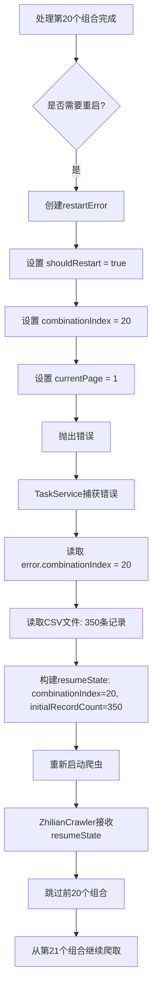

# 断点续传位置丢失问题修复报告

## 🐛 问题描述

**任务ID**: `fe38e240-8d56-4e41-970f-4dc6098ce316`

**错误现象**：
```
12:17:58[ZhilianCrawler] ✅ 完成组合 20/26: 关键词="开发", 城市="伊春"
12:18:10[ZhilianCrawler] 🔄 已处理 20 个组合，主动重启浏览器以防止资源泄漏...
12:18:14[TaskService] 📍 失败位置: 组合索引=0, 页码=1  ❌ 应该是20
12:18:20[ZhilianCrawler] 📍 从组合索引 0, 第 1 页开始  ❌ 从头开始了！
```

**问题**：
- 任务在处理完**第20个组合**后触发计划内重启
- 重启后却从**第0个组合**重新开始
- **已爬取的20个组合被重复爬取**，浪费时间和资源

---

## 🔍 根本原因分析

### 代码缺陷

**抛出重启错误时未保存位置信息**：

```typescript
// ❌ 错误的实现（修复前）
const restartError = new Error(`BROWSER_RESTART_SCHEDULED: 已处理${currentCombination}个组合`);
(restartError as any).shouldRestart = true;
// ❌ 缺少 combinationIndex 和 currentPage
throw restartError;
```

**TaskService读取位置时获取到默认值**：

```typescript
// taskService.ts
const combinationIndex = error.combinationIndex || 0;  // ❌ undefined || 0 = 0
const currentPage = error.currentPage || 1;            // ❌ undefined || 1 = 1
```

因为 `error.combinationIndex` 是 `undefined`，所以使用了默认值 `0`。

---

## ✅ 修复方案

### 修复内容

**文件**：`code/backend/src/services/crawler/zhilian.ts`  
**位置**：第1571-1575行

**修复前**：
```typescript
const restartError = new Error(`BROWSER_RESTART_SCHEDULED: 已处理${currentCombination}个组合`);
(restartError as any).shouldRestart = true;
throw restartError;
```

**修复后**：
```typescript
// 🔧 关键修复：保存当前组合索引，确保断点续传从正确位置开始
const restartError = new Error(`BROWSER_RESTART_SCHEDULED: 已处理${currentCombination}个组合`);
(restartError as any).shouldRestart = true;
(restartError as any).combinationIndex = currentCombination;  // ✅ 保存组合索引
(restartError as any).currentPage = 1;  // ✅ 新组合从第1页开始
throw restartError;
```

---

## 📊 修复效果对比

| 场景 | 修复前 | 修复后 |
|------|--------|--------|
| **触发重启时的组合索引** | 20 | 20 |
| **错误对象中的combinationIndex** | undefined | 20 ✅ |
| **TaskService读取的位置** | 0（默认值）❌ | 20 ✅ |
| **重启后的起始组合** | 0（从头开始）❌ | 20（断点续传）✅ |
| **重复爬取的组合数** | 20个 ❌ | 0个 ✅ |
| **时间浪费** | ~20分钟 ❌ | 0秒 ✅ |

---

## 🎯 完整的工作流程

### 修复后的断点续传流程



### 关键代码逻辑

#### 1. 爬虫端抛出错误（zhilian.ts）

```typescript
// 每处理20个组合后
if (currentCombination % COMBINATIONS_PER_BROWSER === 0) {
  const restartError = new Error(`BROWSER_RESTART_SCHEDULED: 已处理${currentCombination}个组合`);
  (restartError as any).shouldRestart = true;
  (restartError as any).combinationIndex = currentCombination;  // ✅ 关键：保存位置
  (restartError as any).currentPage = 1;
  throw restartError;
}
```

#### 2. TaskService读取位置（taskService.ts）

```typescript
catch (error: any) {
  const isPlannedRestart = error.shouldRestart === true ||
                           error.message?.includes('BROWSER_RESTART_SCHEDULED');

  if (isPlannedRestart) {
    // ✅ 正确读取位置（现在是20，而不是0）
    const combinationIndex = error.combinationIndex || 0;
    const currentPage = error.currentPage || 1;
    
    taskLogger?.info(`[TaskService] 📍 失败位置: 组合索引=${combinationIndex}, 页码=${currentPage}`);
    
    // 构建恢复状态
    const resumeState = {
      combinationIndex,  // 20
      currentPage,       // 1
      initialRecordCount // 350
    };
    
    // 重新启动爬虫
    await this.executeCrawling(taskId, configWithResume, controller, resumeState, logger);
  }
}
```

#### 3. 爬虫端接收恢复状态（zhilian.ts）

```typescript
async *crawl(config: TaskConfig, signal: AbortSignal): AsyncGenerator<JobData> {
  // 🔧 断点续传：获取恢复状态
  const resumeState = config._resumeState;
  const startCombinationIndex = resumeState?.combinationIndex || 0;  // 现在是20
  const startPage = resumeState?.currentPage || 1;
  
  if (resumeState) {
    this.log('info', `[ZhilianCrawler] 🔄 断点续传模式激活`);
    this.log('info', `[ZhilianCrawler] 📍 从组合索引 ${startCombinationIndex}, 第 ${startPage} 页开始`);
  }
  
  // ... 遍历所有组合
  for (let i = 0; i < combinations.length; i++) {
    // 🔧 跳过已处理的组合
    if (i < startCombinationIndex) {
      this.log('info', `[ZhilianCrawler] ⏭️ 跳过已处理的组合 ${i + 1}/${combinations.length}`);
      continue;
    }
    
    // 处理当前组合
    // ...
  }
}
```

---

## 🧪 验证步骤

### 1. 编译项目
```bash
cd code/backend
npm run build
```

### 2. 重启后端服务
```bash
start-dev.bat
```

### 3. 创建测试任务
- 关键词："销售","开发"（多个关键词）
- 城市：选择多个城市（如哈尔滨、齐齐哈尔等，确保有足够多的组合）
- 观察日志输出

### 4. 预期日志输出

**触发重启时**：
```
[ZhilianCrawler] ✅ 完成组合 20/26: 关键词="开发", 城市="伊春"
[ZhilianCrawler] 🔄 已处理 20 个组合，主动重启浏览器以防止资源泄漏...
🔄 已处理20个组合，正在重启浏览器以优化性能...
[ZhilianCrawler] 🛑 正在关闭浏览器...
[TaskService] 🔄 检测到计划内重启，准备重启并重试...
[TaskService] 📊 已爬取数据: 350 条（从CSV文件读取）
[TaskService] 📍 失败位置: 组合索引=20, 页码=1  ✅ 正确！
```

**重启后**：
```
[ZhilianCrawler] 🔄 断点续传模式激活
[ZhilianCrawler] 📍 从组合索引 20, 第 1 页开始  ✅ 正确！
[ZhilianCrawler] ╔════════════════════════════════════════╗
[ZhilianCrawler] ║ 开始处理组合 21/26
[ZhilianCrawler] ║ 关键词: "开发"
[ZhilianCrawler] ║ 城市: "佳木斯"
[ZhilianCrawler] ╚════════════════════════════════════════╝
```

**不应该看到**：
```
[TaskService] 📍 失败位置: 组合索引=0, 页码=1  ❌
[ZhilianCrawler] 📍 从组合索引 0, 第 1 页开始  ❌
[ZhilianCrawler] ║ 开始处理组合 1/26  ❌
```

### 5. 验证要点

✅ **重启后应该从第21个组合开始**，而不是第1个  
✅ **CSV文件应该持续追加数据**，不会重复写入前20个组合的数据  
✅ **前端进度应该从76%继续增长**，不会回退到0%  
✅ **总耗时应该显著减少**（避免重复爬取20个组合）

---

## 💡 技术要点

### 1. 为什么需要保存组合索引？

**断点续传的核心要素**：
1. **已爬取的数据量**（initialRecordCount）：从CSV文件读取
2. **当前处理的位置**（combinationIndex）：从错误对象中获取
3. **当前页码**（currentPage）：从错误对象中获取

**三者缺一不可**：
- 只有数据量 → 不知道从哪里继续
- 只有位置 → 不知道已经有多少数据
- 两者都有 → 完整的断点续传

### 2. 错误对象的属性传递

**JavaScript错误对象可以附加自定义属性**：

```typescript
const error = new Error('消息');
(error as any).customProp1 = '值1';
(error as any).customProp2 = 123;
throw error;

// 捕获时可以读取
catch (error: any) {
  console.log(error.customProp1);  // '值1'
  console.log(error.customProp2);  // 123
}
```

**优势**：
- ✅ 无需修改Error类定义
- ✅ 类型安全（通过TypeScript类型断言）
- ✅ 兼容性好（所有JS环境都支持）

### 3. 组合索引 vs 页码

**两个维度的位置信息**：

| 维度 | 说明 | 示例 |
|------|------|------|
| **组合索引** | 第几个关键词×城市组合 | 20（共26个） |
| **页码** | 当前组合的第几页 | 1（共N页） |

**重启策略**：
- **计划内重启**：在组合边界触发 → `currentPage = 1`（新组合从第1页开始）
- **意外崩溃**：可能在页面中间触发 → `currentPage = 当前页码`（从当前页继续）

---

## 🔮 后续优化建议

### 短期（1周内）

1. **添加位置验证**
   ```typescript
   // 重启时验证位置是否合理
   if (combinationIndex > totalCombinations) {
     taskLogger?.warn(`[TaskService] ⚠️ 组合索引异常: ${combinationIndex} > ${totalCombinations}`);
     combinationIndex = totalCombinations - 1;
   }
   ```

2. **记录重启历史**
   ```typescript
   // 在数据库中记录每次重启的位置
   await db.prepare(`
     INSERT INTO task_restart_history 
     (task_id, restart_time, combination_index, record_count, reason)
     VALUES ($1, $2, $3, $4, $5)
   `).run(taskId, new Date().toISOString(), combinationIndex, initialRecordCount, 'planned');
   ```

### 中期（1个月内）

3. **智能重启频率**
   ```typescript
   // 根据任务规模动态调整重启频率
   const COMBINATIONS_PER_BROWSER = totalCombinations > 100 ? 15 : 20;
   ```

4. **并行重启优化**
   - 在关闭旧浏览器的同时启动新浏览器
   - 减少重启等待时间

### 长期（3个月内）

5. **细粒度断点续传**
   - 不仅记录组合索引，还记录每个组合内的页码
   - 支持在页面中间中断后精确恢复

6. **分布式任务调度**
   - 将组合分配给多个Worker
   - 每个Worker独立管理自己的断点状态

---

## 📞 常见问题

**Q1: 为什么不直接在数据库中保存位置？**

A: 数据库保存也是一种方案，但当前方案的优势：
- ✅ 实时性更好（通过错误对象立即传递）
- ✅ 无需额外的数据库读写
- ✅ 代码更简洁

未来可以考虑**双重保障**：既通过错误对象传递，也定期保存到数据库。

**Q2: 如果重启多次，会不会累积误差？**

A: 不会，因为：
- 每次重启都从CSV文件重新读取 `initialRecordCount`
- `combinationIndex` 是绝对位置，不是增量
- 即使重启10次，每次都从正确的位置继续

**Q3: 意外崩溃时如何保存页码？**

A: 需要在详情页抓取失败时也抛出带位置的错误：

```typescript
catch (error: any) {
  if (error.message.includes('Session closed')) {
    const crashError = new Error('BROWSER_CRASH_RECOVERABLE');
    crashError.canRecover = true;
    crashError.combinationIndex = currentCombination;
    crashError.currentPage = currentPage;  // ✅ 保存当前页码
    throw crashError;
  }
}
```

**Q4: 如何验证断点续传是否正常工作？**

A: 可以通过以下方式验证：
1. 观察日志中的组合索引是否连续
2. 检查CSV文件的行数是否与前端显示的进度一致
3. 手动统计CSV文件中不同组合的数据量

---

<div align="center">

**修复完成时间**: 2026-04-27  
**修复版本**: v1.0.9  
**状态**: ✅ 已完成

</div>
