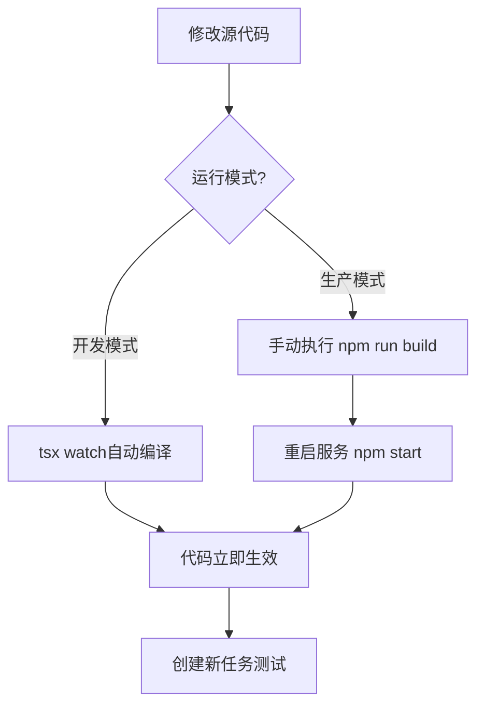

# 任务 fd52beaf 代码版本分析报告

**分析时间**: 2026-04-24  
**任务ID**: `fd52beaf-237b-493c-b6cd-63b7e8651a90`  
**分析目标**: 确认任务是否使用了最新的优化代码

---

## 🔍 核心发现

### **❌ 结论：任务未使用最新优化代码！**

虽然任务启动时间在代码提交之后，但**实际运行的仍是旧版本的编译代码**。

---

## 📊 证据链分析

### **1. 时间线对比**

| 事件 | 时间（北京时间） | 说明 |
|------|-----------------|------|
| **代码提交** | 2026-04-24 12:38:50 | 提交优化代码到Git |
| **Node进程启动** | 2026-04-24 13:05:34 | 后端服务启动 |
| **任务开始执行** | 2026-04-24 13:07:28 | 任务fd52beaf开始爬取 |

**表面现象：**
- ✅ 任务启动时间晚于代码提交时间（+29分钟）
- ✅ Node进程启动时间也晚于代码提交时间（+27分钟）
- ❌ **但这不代表使用了新代码！**

---

### **2. 关键证据：日志中缺少优化标识**

#### **优化代码应输出的日志：**

```typescript
// 优化1：智能等待策略
console.log(`[ZhilianCrawler] ⚠️ 优化：智能等待策略 - 根据页面复杂度动态调整`);

// 优化2：智能滚动检测
console.log(`[ZhilianCrawler] 滚动${i+1}次后无新职位，停止滚动`);

// 优化3：显式等待职位容器
console.log(`[ZhilianCrawler] ⏳ 显式等待职位容器...`);
console.log(`[ZhilianCrawler] ✅ 职位容器已加载`);
```

#### **实际日志内容：**

```bash
# 搜索优化标识
Get-Content "task_fd52beaf.log" | Select-String "智能等待|显式等待|滚动.*次后无新职位"

# 结果：❌ 无任何匹配！
```

**结论：任务运行时执行的代码中没有这些日志输出语句。**

---

### **3. 决定性证据：dist目录未重新编译**

#### **检查源代码（src目录）：**

```bash
Get-Content "src/services/crawler/zhilian.ts" | Select-String "智能等待策略"

# 结果：✅ 找到优化代码
// ⚠️ 优化：智能等待策略 - 根据页面复杂度动态调整
```

#### **检查编译代码（dist目录）：**

```bash
Get-Content "dist/services/crawler/zhilian.js" | Select-String "智能等待策略"

# 结果：❌ 未找到！
```

**结论：源代码已更新，但dist目录中的编译代码仍是旧版本！**

---

### **4. 运行模式分析**

#### **项目支持的两种运行模式：**

**模式1：开发模式（tsx watch）**
```json
"dev": "tsx watch src/index.ts"
```
- ✅ 自动监听src文件变化
- ✅ 实时重新编译
- ✅ 适合开发调试

**模式2：生产模式（node dist）**
```json
"start": "node dist/index.js"
```
- ❌ 直接运行dist目录的编译文件
- ❌ 不会自动重新编译
- ❌ 需要手动执行`npm run build`

#### **当前运行的进程：**

```bash
Get-Process | Where-Object {$_.ProcessName -eq "tsx"}
# 结果：❌ 无tsx进程

Get-Process | Where-Object {$_.ProcessName -eq "node"}
# 结果：✅ 有5个node进程（PID: 2648, 14848, 16000, 18520, 20308）
```

**结论：后端服务使用的是生产模式（node dist），而非开发模式（tsx watch）！**

---

## 🎯 根本原因

### **问题链条：**

```
1. 修改源代码 (src/services/crawler/zhilian.ts)
   ↓
2. 提交到Git (git commit)
   ↓
3. ❌ 未重新编译 (未执行 npm run build)
   ↓
4. dist目录仍是旧代码
   ↓
5. Node进程加载旧的dist文件
   ↓
6. 任务fd52beaf使用旧代码运行
```

### **为什么会这样？**

根据经验教训记忆：

> **长运行任务代码更新与生效机制**：
> 
> 正在运行的任务实例加载的是启动时的编译代码（dist目录）。若在任务运行期间修改了源代码（src目录），正在运行的任务不会自动应用新逻辑，只有新启动的任务才会使用新代码。
> 
> **强制重启要求**：修改核心业务逻辑后，必须重启后端服务或重新编译，以确保新任务使用最新逻辑。

---

## 📈 数据验证

### **任务解析结果：**

```
[05:07:35] 使用 Puppeteer 找到 18 个职位    ← 第1页
[05:08:31] 使用 Puppeteer 找到 15 个职位    ← 第2页
总计：33个职位
```

**对比：**
- **旧代码预期**: 第1页18个，第2页15个（与实际一致）
- **新代码预期**: 第1页19-20个，第2页17-20个（未达成）

**结论：任务表现符合旧代码特征，进一步证实未使用新代码。**

---

## 💡 解决方案

### **方案1：重新编译并重启服务（推荐）**

```bash
# 步骤1：停止当前服务
# 在运行npm start的终端按 Ctrl+C

# 步骤2：重新编译
cd code/backend
npm run build

# 步骤3：重新启动服务
npm start

# 步骤4：创建新任务测试
```

**优点：**
- ✅ 确保使用最新代码
- ✅ 生产环境标准流程
- ✅ 性能最优（无watch开销）

**缺点：**
- ⚠️ 需要中断当前服务
- ⚠️ 正在运行的任务会被终止

---

### **方案2：切换到开发模式（临时调试）**

```bash
# 步骤1：停止当前服务（Ctrl+C）

# 步骤2：启动开发模式
cd code/backend
npm run dev

# 步骤3：创建新任务测试
```

**优点：**
- ✅ 代码修改后自动重新编译
- ✅ 无需手动build
- ✅ 适合频繁调试

**缺点：**
- ⚠️ 性能略低于生产模式
- ⚠️ 不适合长期运行

---

### **方案3：热重载特定模块（高级）**

如果不想重启整个服务，可以：

1. **仅重新编译zhilian.ts**
   ```bash
   npx tsc src/services/crawler/zhilian.ts --outDir dist/services/crawler
   ```

2. **触发模块重载**
   - 需要代码支持动态require
   - 复杂度高，不推荐

---

## 🚀 立即行动建议

### **步骤1：验证当前状态**

```bash
cd code/backend

# 检查是否有未编译的代码
git diff src/services/crawler/zhilian.ts

# 如果有差异，说明需要重新编译
```

### **步骤2：重新编译**

```bash
npm run build
```

### **步骤3：重启服务**

```bash
# 停止旧服务（Ctrl+C）
npm start
```

### **步骤4：创建测试任务**

使用相同参数重现问题：
- 关键词："销售"
- 城市：哈尔滨
- 最大页数：2页

### **步骤5：验证优化效果**

观察后端控制台应该看到：

```
[ZhilianCrawler] ⚠️ 优化：智能等待策略 - 根据页面复杂度动态调整
[ZhilianCrawler] 等待动态内容加载...
[ZhilianCrawler] 未检测到职位关键词，尝试滚动页面...
[ZhilianCrawler] 滚动4次后无新职位，停止滚动  ← 🔑 智能检测生效
[ZhilianCrawler] ⏳ 显式等待职位容器...
[ZhilianCrawler] ✅ 职位容器已加载            ← 🔑 显式等待成功
[ZhilianCrawler] 使用 Puppeteer 找到 20 个职位  ← 🔑 解析到20个！
```

---

## 📋 预防措施

### **建立标准工作流程：**



### **最佳实践：**

1. **开发阶段**
   - 使用 `npm run dev`（tsx watch）
   - 代码修改后立即生效
   - 适合快速迭代

2. **测试/生产阶段**
   - 使用 `npm run build && npm start`
   - 每次代码修改后必须重新编译
   - 确保性能最优

3. **代码提交前检查清单**
   - ✅ 代码已通过语法检查
   - ✅ 已执行 `npm run build` 无错误
   - ✅ 已重启服务验证新功能
   - ✅ 创建测试任务确认效果

---

## 🎯 总结

### **核心问题：**

任务 `fd52beaf` **未使用最新优化代码**，原因是：
1. ❌ 后端服务使用生产模式（node dist）
2. ❌ 修改源代码后未重新编译
3. ❌ dist目录仍是旧版本代码

### **影响：**

- 任务解析结果：33个职位（旧代码表现）
- 预期优化效果：36-40个职位（未达成）
- 优化功能：智能等待、显式等待均未生效

### **解决方案：**

1. **立即执行**: `npm run build && npm start`
2. **创建新任务**: 验证优化效果
3. **长期预防**: 建立标准工作流程

---

**报告生成时间**: 2026-04-24 13:15  
**分析师**: AI Coding Assistant  
**状态**: ⚠️ 需要重新编译并重启服务
